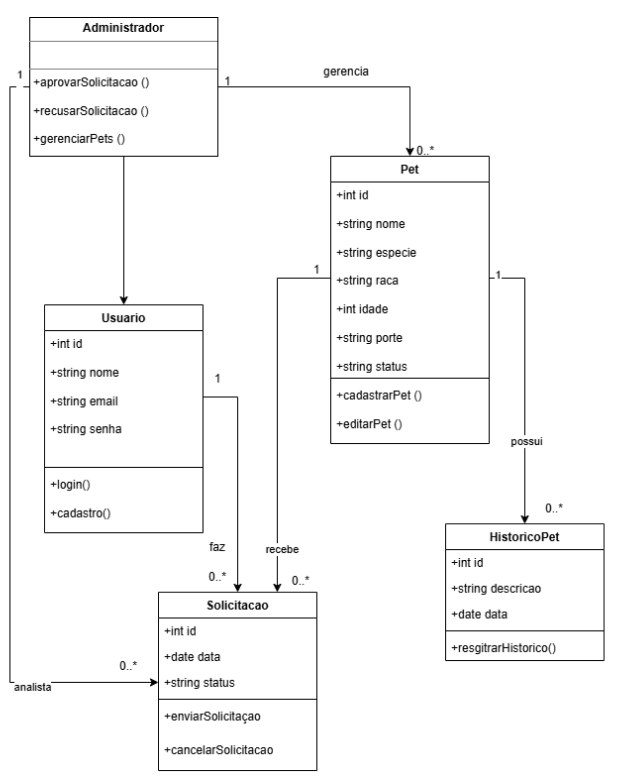

# Descrição breve do sistema
## Whiskerworld

Whiskerworld é um sistema web para aproximar adotantes, ONGs e administradores no processo de adocao de caes e gatos. A aplicacao permite visualizar pets disponiveis, cadastrar usuarios, autenticar adotantes e administradores, favoritar animais, solicitar/agendar visitas e gerenciar pets e agendamentos pela area administrativa.

# Arquitetura resumida
## Diagrama de Classes
  
O diagrama representa a estrutura estática do sistema Whiskerworld, evidenciando as principais entidades, seus atributos, métodos e os relacionamentos existentes entre elas. 
No diagrama, destacam-se classes como Usuário, Administrador, Pet, Solicitação e Histórico do Pet. A classe Administrador herda características da classe Usuário, indicando uma relação de especialização. Além disso, observa-se que um usuário pode realizar múltiplas solicitações de adoção, enquanto cada pet pode estar associado a várias solicitações e possuir um histórico de registros.
<p align="center">
  
</p>

# Como executar o sistema

## 1. Conectar ao Firebase

### 1.1 Service Account (backend)

1. Acesse [console.firebase.google.com](https://console.firebase.google.com/) → seu projeto
2. **Configurações do projeto (⚙️) → Contas de serviço → Gerar nova chave privada**
3. Salve o `.json` gerado (ex: `Downloads/whiskerworld-service-account.json`)
4. **Nunca suba esse arquivo para o repositório**

### 1.2 Credenciais do cliente (frontend)

1. **Configurações do projeto (⚙️) → Geral → Seus apps → Web (`</>`)**
2. Copie o objeto `firebaseConfig` e cole em `client/src/firebase.js` substituindo os valores existentes

---

## 2. Variáveis de ambiente

Crie um arquivo `.env` na **raiz do projeto** (ao lado de `package.json`):

```env
FIREBASE_SERVICE_ACCOUNT_PATH=C:/caminho/para/seu-arquivo-service-account.json
FIREBASE_STORAGE_BUCKET=seu-projeto.firebasestorage.app
```

> **Atenção:** use barras `/` no caminho, mesmo no Windows.

---

## 3. Instalar dependências

```bash
# Na raiz — instala dependências do backend
npm install

# Na pasta client — instala dependências do frontend
cd client
npm install
cd ..
```

Ou use o atalho:

```bash
npm run install:all
```

---

## 4. Inicializar o sistema

Abra **dois terminais** na raiz do projeto:

**Terminal 1 — Backend:**
```bash
npm start
```
O servidor inicia em `http://localhost:3000`

**Terminal 2 — Frontend (Vite):**
```bash
cd client
npm run dev
```
O frontend inicia em `http://localhost:5173`

Ou use o comando combinado (requer o terminal suportar `concurrently`):
```bash
npm run dev
```

### Acessar o sistema

| URL | Descrição |
|---|---|
| `http://localhost:5173` | Aplicação React (use este) |
| `http://localhost:3000/api/health` | Verificar se a API está no ar |

---
