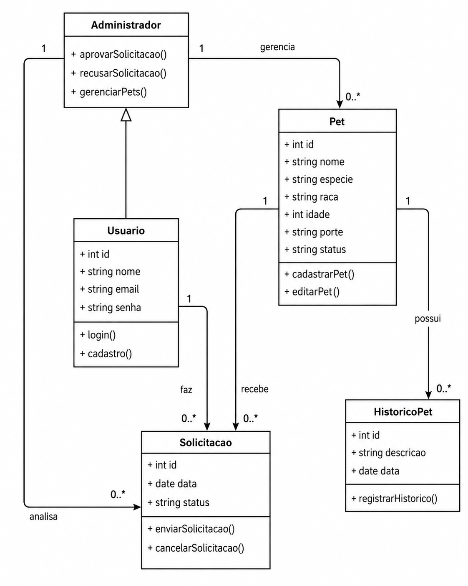

# Apresentação do Sistema

## Whiskerworld

### Descrição do sistema

O **Whiskerworld** é uma aplicação web voltada ao processo de adoção de cães e gatos, desenvolvida com o objetivo de aproximar adotantes, ONGs e responsáveis pela administração da plataforma. Por meio do sistema, os usuários podem visualizar animais disponíveis para adoção, criar e autenticar suas contas, favoritar pets e solicitar ou agendar visitas.

Além das funcionalidades destinadas aos adotantes, o sistema disponibiliza uma área administrativa para gerenciamento dos animais cadastrados e dos agendamentos realizados. Dessa forma, o Whiskerworld busca centralizar em uma única plataforma as principais atividades envolvidas no processo de disponibilização, acompanhamento e adoção de animais.

---

## Arquitetura do Sistema

O Whiskerworld é organizado em uma arquitetura que separa a interface utilizada pelos usuários das funcionalidades responsáveis pelo processamento e armazenamento dos dados. O frontend disponibiliza as telas e interações da aplicação, enquanto o backend concentra as regras necessárias para o funcionamento do sistema e a comunicação com os serviços utilizados para persistência dos dados.

A estrutura das principais entidades do domínio pode ser observada no diagrama de classes apresentado a seguir.

### Diagrama de Classes

O diagrama representa a estrutura estática do sistema Whiskerworld, evidenciando suas principais entidades, atributos, métodos e relacionamentos.

Entre as classes representadas estão **Usuário**, **Administrador**, **Pet**, **Solicitação** e **Histórico do Pet**. A classe `Administrador` especializa a classe `Usuário`, enquanto um usuário pode realizar múltiplas solicitações. Da mesma forma, um pet pode estar relacionado a diferentes solicitações e possuir registros associados ao seu histórico.



---

# Como executar o sistema

## 1. Configurar o Firebase

Antes de executar a aplicação localmente, é necessário configurar as credenciais utilizadas pelo backend e pelo frontend.

### 1.1 Service Account — Backend

1. Acesse o [Firebase Console](https://console.firebase.google.com/) e selecione o projeto.
2. Vá em **Configurações do projeto (⚙️) → Contas de serviço → Gerar nova chave privada**.
3. Salve o arquivo `.json` gerado em um local seguro.
4. **Não adicione esse arquivo ao repositório GitHub.**

### 1.2 Credenciais do cliente — Frontend

1. Acesse **Configurações do projeto (⚙️) → Geral → Seus apps → Web (`</>`)**.
2. Copie o objeto `firebaseConfig`.
3. Configure os respectivos valores em `client/src/firebase.js`.

---

## 2. Configurar as variáveis de ambiente

Crie um arquivo `.env` na raiz do projeto, ao lado do `package.json`:

```env
FIREBASE_SERVICE_ACCOUNT_PATH=C:/caminho/para/seu-arquivo-service-account.json
FIREBASE_STORAGE_BUCKET=seu-projeto.firebasestorage.app
```

> **Atenção:** no Windows, utilize barras `/` no caminho do arquivo.

---

## 3. Instalar as dependências

Na raiz do projeto, instale as dependências do backend:

```bash
npm install
```

Em seguida, instale as dependências do frontend:

```bash
cd client
npm install
cd ..
```

Também é possível instalar todas as dependências utilizando:

```bash
npm run install:all
```

---

## 4. Inicializar o sistema

Para executar backend e frontend separadamente, abra dois terminais na raiz do projeto.

### Backend

```bash
npm start
```

O servidor estará disponível em:

`http://localhost:3000`

### Frontend

```bash
cd client
npm run dev
```

O frontend estará disponível em:

`http://localhost:5173`

Também é possível utilizar o comando combinado:

```bash
npm run dev
```

---

## Acessar o sistema

| Endereço | Finalidade |
|---|---|
| `http://localhost:5173` | Interface principal da aplicação |
| `http://localhost:3000/api/health` | Verificação do funcionamento da API |
