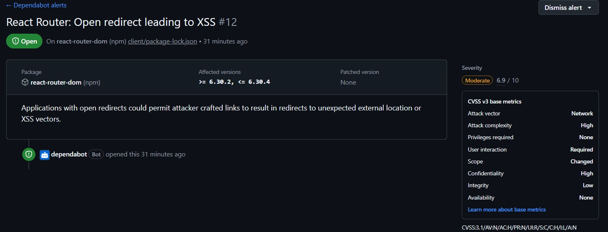

# Bugs e Classificação

## 1. Introdução

Durante a etapa de manutenção corretiva do sistema Whiskerworld, o grupo realizou uma análise do código e das dependências utilizadas no projeto com o objetivo de identificar falhas que pudessem comprometer o funcionamento, a segurança ou a confiabilidade da aplicação.

Foram identificados quatro bugs, sendo três encontrados por meio da análise do próprio sistema e um identificado com o apoio do Dependabot, conforme solicitado na atividade.

---

## 2. Bugs Identificados

### 2.1 BUG-001 — Agendamentos aos domingos pela API

- **Classificação:** Lógica
- **Severidade:** Alta
- **Local:** Backend responsável pela criação de agendamentos
- **Descrição:** O sistema permitia a criação de agendamentos aos domingos quando a requisição era feita diretamente para a API.

Embora o frontend impedisse a seleção de domingos para visitas, o backend não possuía a mesma validação. Dessa forma, uma requisição enviada diretamente para a API conseguia criar um agendamento em um dia que deveria ser bloqueado.

O problema foi classificado como um bug lógico, pois o sistema executava corretamente a requisição, porém aplicava uma regra de negócio incorreta.

---

### 2.2 BUG-002 — Cadastro de animal com campos contendo apenas espaços

- **Classificação:** Lógica
- **Severidade:** Média
- **Local:** Funcionalidade de cadastro de animais
- **Descrição:** O sistema permitia cadastrar um animal mesmo quando determinados campos de texto eram preenchidos apenas com espaços em branco.

Como os valores não eram tratados adequadamente antes da validação, entradas sem conteúdo real eram consideradas válidas.

O problema foi classificado como bug lógico porque a validação existente não verificava corretamente o conteúdo informado pelo usuário.

---

### 2.3 BUG-003 — Cadastro público de contas administrativas

- **Classificação:** Segurança
- **Severidade:** Crítica
- **Local:** Fluxo de cadastro de usuários
- **Descrição:** O sistema permitia que um usuário comum criasse uma conta com perfil de administrador por meio do cadastro público.

Esse comportamento poderia permitir acesso indevido a funcionalidades restritas do sistema.

O problema foi classificado como bug de segurança, pois comprometia o controle de acesso da aplicação e poderia permitir privilégios administrativos a usuários não autorizados.

---

### 2.4 BUG-004 — Dependência vulnerável do React Router

- **Classificação:** Dependência vulnerável
- **Severidade:** Moderada
- **Dependência:** `react-router-dom`
- **Ferramenta utilizada:** Dependabot
- **Vulnerabilidade identificada:** Open Redirect leading to XSS
- **CVSS:** 6.9/10

O Dependabot identificou uma vulnerabilidade na dependência `react-router-dom` utilizada pelo frontend do sistema.

O alerta indicou a possibilidade de Open Redirect, que pode permitir que links manipulados redirecionem usuários para destinos externos inesperados e, em determinados cenários, contribuir para vetores de XSS.

O alerta foi analisado pelo grupo e considerado relevante para o projeto, sendo registrado como um bug de dependência vulnerável.

### Evidência do Dependabot

---

## 3. Ferramenta de Apoio Utilizada

Foi utilizado o Dependabot, ferramenta integrada ao GitHub responsável por analisar as dependências do projeto e identificar vulnerabilidades conhecidas.

Durante a análise, o Dependabot gerou um alerta relacionado ao pacote `react-router-dom`, indicando uma vulnerabilidade de Open Redirect leading to XSS, com severidade moderada e pontuação CVSS 6.9/10.

Após a análise do alerta, o grupo decidiu registrar o problema como BUG-004 e realizar a atualização da dependência.

---

## 4. Considerações Finais

A análise permitiu identificar problemas de diferentes naturezas no sistema Whiskerworld, incluindo falhas de lógica, segurança e vulnerabilidades em dependências externas.

A utilização do Dependabot complementou a análise manual do código e permitiu identificar um problema que poderia não ser percebido apenas durante os testes funcionais da aplicação.

Os bugs identificados foram posteriormente registrados como Issues no GitHub e encaminhados para o fluxo de triagem, correção e validação.