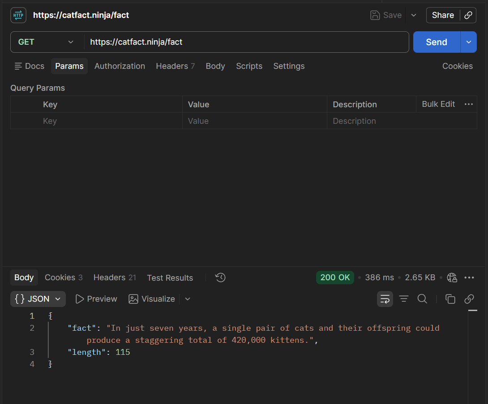
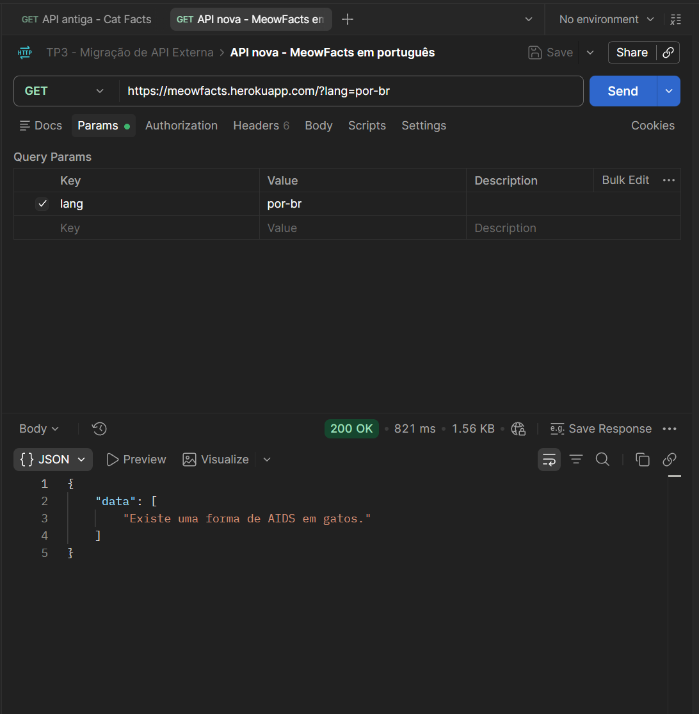
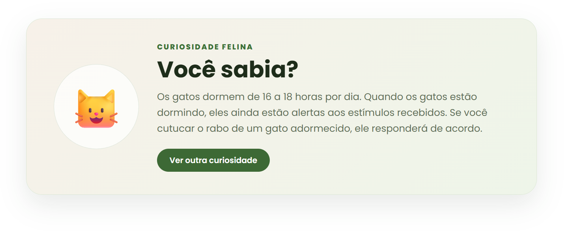

# Evidência 3 — Migração de API Externa

## 1. Objetivo

Esta estratégia simula a migração de uma API externa utilizada para fornecer curiosidades sobre gatos na página inicial do WhiskerWorld.

Como o sistema não possuía uma integração pública adequada para demonstrar uma migração entre endpoints, foi implementado o cenário permitido pelo enunciado do trabalho: a substituição simulada de uma API pública por outra equivalente.

## 2. Cenário anterior

No cenário inicial, foi considerada a utilização da Cat Facts API:

```text
GET https://catfact.ninja/fact
```

Essa API retorna a curiosidade no atributo `fact`:

```json
{
  "fact": "Exemplo de curiosidade sobre gatos",
  "length": 40
}
```

A requisição foi testada no Postman e retornou o status HTTP `200 OK`.



## 3. Problema adaptativo

A mudança do serviço externo exige a adaptação do sistema porque o novo endpoint apresenta uma estrutura de resposta diferente.

Na API anterior, o texto era obtido por meio de:

```js
data.fact
```

Na nova API, a curiosidade é retornada dentro da primeira posição do vetor `data`:

```js
data.data[0]
```

Sem essa adaptação, a aplicação não conseguiria localizar e exibir o conteúdo retornado pelo novo serviço.

## 4. Nova API

O sistema foi migrado para a MeowFacts API, configurada para retornar o conteúdo em português brasileiro:

```text
GET https://meowfacts.herokuapp.com/?lang=por-br
```

O novo formato de resposta é:

```json
{
  "data": [
    "Exemplo de curiosidade sobre gatos"
  ]
}
```

O endpoint também foi validado no Postman, retornando o status HTTP `200 OK`.



A coleção utilizada nos testes está disponível no arquivo:

```text
colecao-postman-migracao-api.json
```

## 5. Adaptação implementada

Foi criado o serviço:

```text
client/src/services/catFactsService.js
```

Esse serviço concentra a comunicação com a API externa, verifica o status da resposta e adapta o novo formato antes de retornar a curiosidade para a interface.

A página inicial também foi modificada para:

- carregar uma curiosidade automaticamente;
- apresentar uma mensagem durante o carregamento;
- tratar falhas da API;
- exibir a curiosidade recebida;
- permitir a solicitação de uma nova curiosidade;
- informar atualizações do conteúdo por meio de `aria-live`.

O estilo da nova seção foi adicionado ao arquivo:

```text
client/src/styles/global.css
```

## 6. Resultado após a migração

A curiosidade passou a ser exibida em português na página inicial do WhiskerWorld, em uma seção integrada à identidade visual da aplicação.



O botão **Ver outra curiosidade** realiza uma nova requisição e atualiza o conteúdo exibido sem recarregar a página inteira.

## 7. Validação

A manutenção foi validada por meio de:

- requisição ao endpoint antigo no Postman;
- requisição ao novo endpoint no Postman;
- comparação entre os formatos JSON;
- exportação da coleção do Postman;
- compilação do frontend;
- testes automatizados do projeto;
- execução da aplicação no navegador;
- solicitação de diferentes curiosidades pelo botão da interface.

## 8. Comparação antes e depois

| Aspecto | Antes | Depois |
|---|---|---|
| Serviço externo | Cat Facts API | MeowFacts API |
| Endpoint | `https://catfact.ninja/fact` | `https://meowfacts.herokuapp.com/?lang=por-br` |
| Campo utilizado | `fact` | `data[0]` |
| Idioma | Inglês | Português brasileiro |
| Integração visual | Não implementada | Seção de curiosidade na página inicial |
| Nova consulta | Não disponível na interface | Botão para solicitar outra curiosidade |
| Tratamento de falhas | Não aplicável | Mensagem de erro na interface |

## 9. Conclusão

A migração demonstra uma manutenção adaptativa porque o sistema foi ajustado para continuar oferecendo a funcionalidade após a mudança do provedor externo e da estrutura dos dados retornados.

Além da substituição do endpoint, a implementação isolou a comunicação externa em um serviço próprio, adicionou tratamento de respostas inesperadas e integrou o recurso à interface do WhiskerWorld. Essa organização facilita futuras alterações de provedor, pois reduz o impacto da dependência externa sobre os demais componentes da aplicação.
