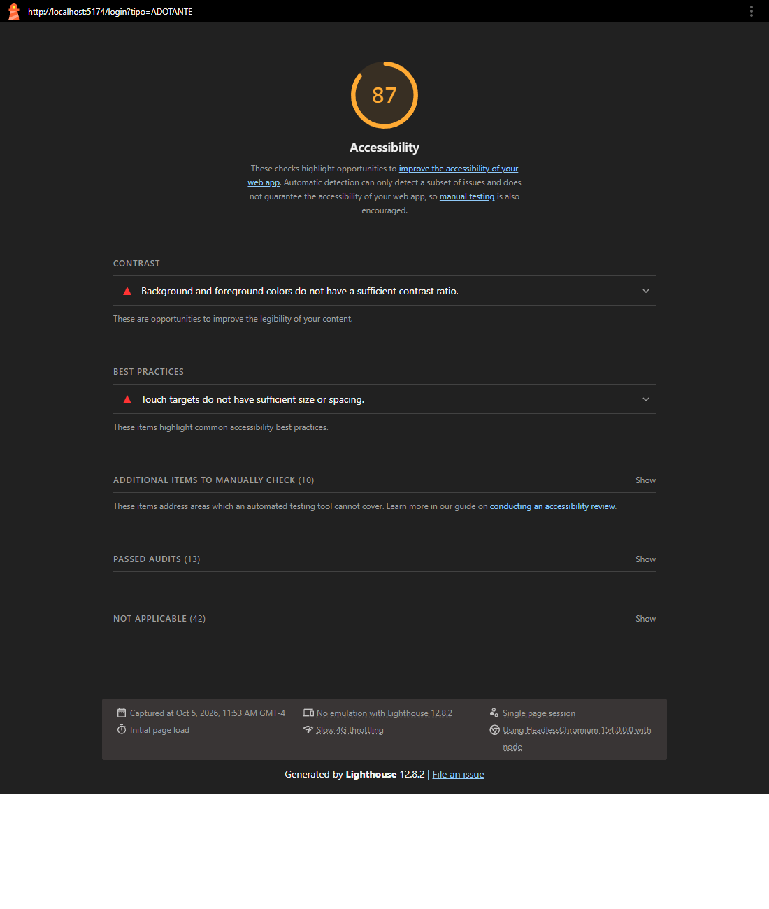
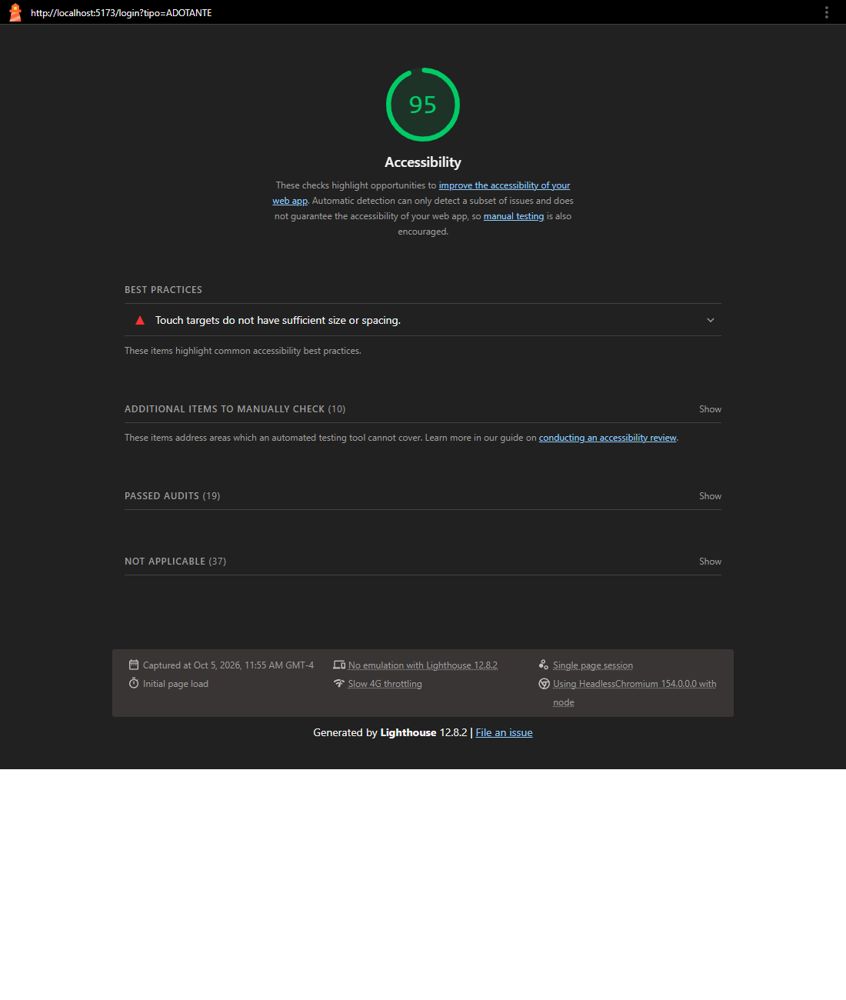
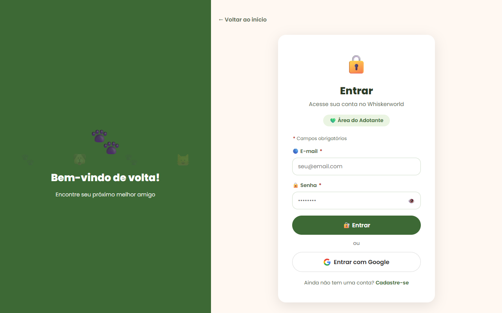
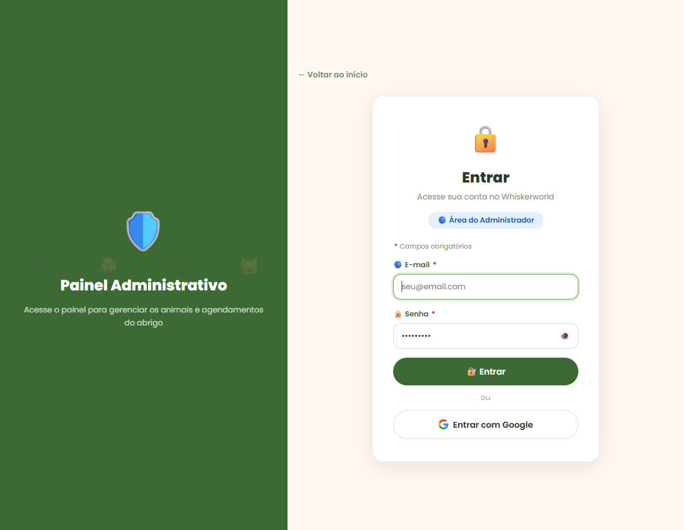
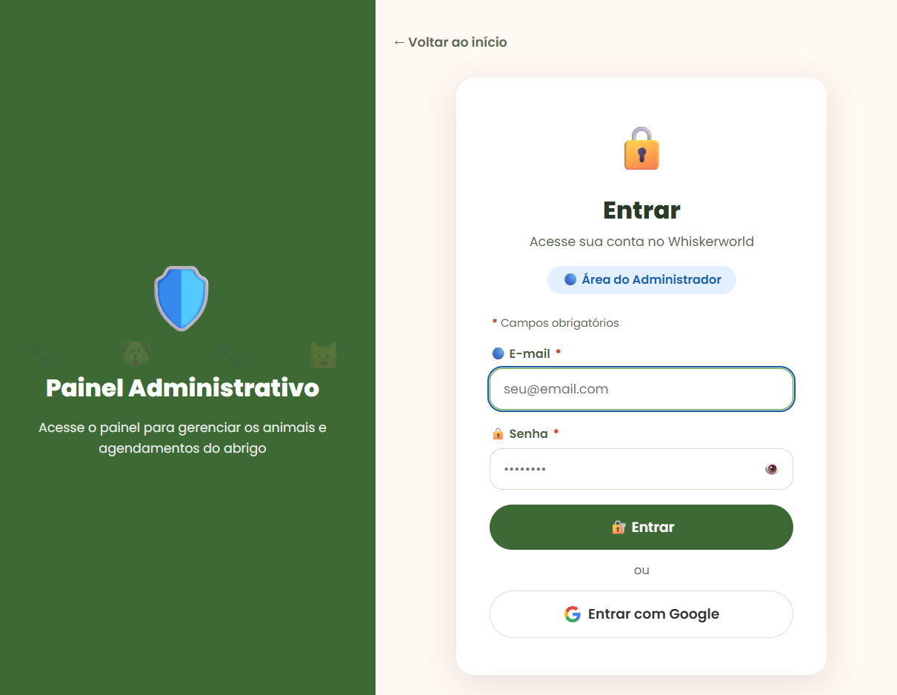

# Melhoria de Acessibilidade — Whiskerworld

## 1. Objetivo

Este documento registra as melhorias de acessibilidade incorporadas ao Whiskerworld na etapa de Manutenção Evolutiva. Para cada melhoria, ele apresenta:

- o problema encontrado no sistema;
- por que esse problema prejudica pessoas com deficiência;
- como a solução implementada corrige o problema;
- as evidências de antes e depois.

Foram implementadas **5 melhorias**, voltadas a três grupos de usuários:

| # | Melhoria | Quem é beneficiado | Critério WCAG 2.1 |
|---|---|---|---|
| 1 | Rótulos associados aos campos de formulário | Pessoas cegas que usam leitor de tela | 1.3.1 · 3.3.2 · 4.1.2 (A) |
| 2 | Nome acessível em botões só com ícone | Pessoas cegas que usam leitor de tela | 4.1.2 (A) |
| 3 | Contraste de cores adequado | Pessoas com baixa visão ou daltonismo | 1.4.3 (AA) |
| 4 | Foco visível na navegação por teclado | Pessoas com deficiência motora e quem navega sem mouse | 2.4.7 (AA) |
| 5 | Modais acessíveis pelo teclado (foco e tecla Esc) | Usuários de teclado e de leitor de tela | 2.1.2 · 2.4.3 (A) |

As melhorias foram aplicadas sobre a versão do sistema que já inclui o redesign da avaliação heurística.

---

## 2. Como os problemas foram identificados

Com o sistema rodando localmente, as telas foram analisadas de três formas:

1. **Auditoria automatizada** com o **Lighthouse**, do Chrome DevTools, e com o [axe-core](https://github.com/dequelabs/axe-core), que é o motor de regras usado pelo Lighthouse. Foram aplicados os critérios da WCAG 2.1, níveis A e AA.
2. **Painel de Acessibilidade do Chrome DevTools**, que mostra o nome que um leitor de tela (NVDA, JAWS, VoiceOver, TalkBack) anuncia para cada campo e botão.
3. **Navegação apenas com teclado** (Tab, Shift+Tab, Enter, Espaço e Esc) nos fluxos principais.

Foram analisadas 13 telas: login, cadastro de adotante, cadastro de animal, as etapas do agendamento, dashboard do adotante, escolha de espécie, listagem e detalhe de animal, compatibilidade, acompanhamento e painel do administrador.

**Resultado antes das melhorias:** 91 problemas em 12 das 13 telas.

| Problema encontrado | Ocorrências |
|---|---|
| Contraste de cor insuficiente | 73 |
| Lista de seleção sem nome | 14 |
| Campo de texto sem rótulo | 4 |

Além disso, os modais não fechavam com a tecla Esc, e o contorno de foco dos botões era quase invisível.

**Resultado depois das melhorias:** 0 problemas nas 13 telas. No Lighthouse do login, a nota de acessibilidade subiu de **87 para 95**. O único item que continua apontado, o tamanho mínimo de alguns alvos de toque (`target-size`), não faz parte das 5 melhorias.

| Antes | Depois |
|---|---|
|  |  |

---

## 3. Melhorias implementadas

### Melhoria 1 — Rótulos associados aos campos de formulário

**Critérios WCAG:** 1.3.1 Informações e relações · 3.3.2 Rótulos ou instruções · 4.1.2 Nome, função e valor

**Problema identificado:** os textos acima dos campos ("Nome", "E-mail", "Sexo", "Porte", "Tipo de moradia"…) eram elementos `<label>` sem o atributo `htmlFor`. Ou seja, não estavam ligados aos campos, e para o navegador o campo não tinha nome.

- No **cadastro de animal** e nas **etapas do agendamento**, 14 listas de seleção eram anunciadas apenas como "lista de seleção".
- No **cadastro de adotante**, os campos Nome, E-mail e Senha eram anunciados apenas como "caixa de texto".
- No **login** e no **agendamento**, o leitor lia o placeholder: o e-mail era anunciado como "seu@email.com", a senha como "••••••••" e o telefone como "(00) 00000-0000".

**Por que impacta pessoas com deficiência:** uma pessoa cega que usa leitor de tela não vê o texto escrito acima do campo. Ela depende do nome anunciado para saber o que preencher. Sem esse nome, ela precisa adivinhar se a lista é "Sexo", "Tipo" ou "Porte", o que torna o cadastro e o agendamento praticamente impossíveis sem ajuda. O placeholder não resolve o problema: ele mostra um exemplo, não o nome do campo, e desaparece quando o usuário começa a digitar.

**Solução implementada:**

- **33 rótulos** foram ligados aos seus campos (`<label htmlFor="…">` + `id` no campo) no login, no cadastro de adotante, no cadastro de animal e nas etapas do agendamento.
- A lista "Meses/Anos" da idade, que não tem rótulo visível, recebeu `aria-label="Unidade da idade"`.
- Os emojis decorativos dos rótulos (🏷️, 📅, 🔵…) foram marcados com `aria-hidden="true"`, para o leitor não anunciar "etiqueta", "calendário" ou "círculo azul" antes do nome do campo.


### Melhoria 2 — Nome acessível em botões só com ícone

**Critério WCAG:** 4.1.2 Nome, função e valor

**Problema identificado:** vários botões mostravam apenas um ícone, e o leitor de tela anunciava o próprio emoji:

| Botão | Antes, o leitor anunciava |
|---|---|
| Excluir animal (painel do admin) | "🗑️" |
| Confirmar e cancelar agendamento (painel do admin) | "✔" e "✖" |
| Remover favorito (dashboard do adotante) | "✕" |
| Mostrar senha (login) | "👁️" |

**Por que impacta pessoas com deficiência:** o usuário de leitor de tela ouvia "lixeira" ou "marca de verificação" sem saber o que o botão fazia nem a qual animal ou agendamento ele se referia. No painel do administrador, isso pode levar a excluir o animal errado ou a confirmar o agendamento errado.

**Solução implementada:** cada botão recebeu um `aria-label` que descreve a ação e o item, e o ícone foi marcado com `aria-hidden="true"`:

| Botão | Depois, o leitor anuncia |
|---|---|
| Excluir animal | "Excluir Luna" |
| Editar animal | "Editar Luna" |
| Confirmar agendamento | "Confirmar agendamento de Alicia de Souza para Luna" |
| Cancelar agendamento | "Cancelar agendamento de Alicia de Souza para Luna" |
| Remover favorito | "Remover Luna dos favoritos" |
| Mostrar senha | "Mostrar senha", com `aria-pressed` para informar se a senha está visível |


### Melhoria 3 — Contraste de cores adequado

**Critério WCAG:** 1.4.3 Contraste (mínimo): 4,5:1 para texto normal

**Problema identificado:** 73 textos não atingiam o contraste mínimo. O caso mais comum era a cor de texto secundário `#7A8C72`, usada em subtítulos, dicas, legendas, datas e nos títulos das etapas do agendamento, com contraste de apenas **3,6:1** sobre o branco. Também falhavam a barra de navegação verde-clara, o menu da conta, o botão "Favoritado", o selo "DISPONÍVEL" e o status "PENDENTE".

**Por que impacta pessoas com baixa visão:** pessoas com baixa visão, daltonismo ou sensibilidade reduzida ao contraste, além de idosos e de quem usa o celular sob luz forte, não conseguem ler texto claro sobre fundo claro. Nesses textos estavam informações importantes, como datas de agendamento, regras de horário, a legenda de campos obrigatórios e o status das solicitações.

**Solução implementada:** a cor de texto secundário (`--text-muted`) passou de `#7A8C72` para `#5C6B55`, e as demais cores reprovadas foram escurecidas até passar de 4,5:1, mantendo a identidade verde do sistema.

| Elemento | Antes | Contraste | Depois | Contraste |
|---|---|---|---|---|
| Texto secundário (`--text-muted`) | `#7A8C72` | 3,6:1 | `#5C6B55` | 5,7:1 |
| Barra de navegação (texto branco) | fundo `#5A8F47` | 3,4:1 | fundo `#3D6935` | 6,4:1 |
| Botão "Favoritado" (texto branco) | fundo `#E05555` | 3,7:1 | fundo `#C0392B` | 5,4:1 |
| Selo "DISPONÍVEL" (texto branco) | fundo `#3A8F30` | 4,1:1 | fundo `#2F7A27` | 5,3:1 |
| Status "PENDENTE" | `#E65100` | 3,5:1 | `#B33F00` | 5,3:1 |
| Links de Termos e Política | `#5A8F47` | 3,8:1 | `#3D6935` | 6,4:1 |
| "ou" do login | `#AAAAAA` | 2,3:1 | `#666666` | 5,7:1 |

| Antes | Depois |
|---|---|
|  |  |

### Melhoria 4 — Foco visível na navegação por teclado

**Critério WCAG:** 2.4.7 Foco visível

**Problema identificado:** ao navegar com a tecla Tab, o elemento focado recebia só o contorno padrão do navegador: uma linha escura de 1 px, praticamente invisível sobre os botões verde-escuros e sobre a barra de navegação.

**Por que impacta pessoas com deficiência:** pessoas com deficiência motora que não usam mouse, e qualquer pessoa que navega pelo teclado, precisam ver onde está o foco para saber qual botão será acionado ao apertar Enter. Sem o foco visível, a navegação vira tentativa e erro.

**Solução implementada:** todos os links e botões ganharam um contorno azul de 3 px, com um halo branco que garante contraste sobre fundos claros e escuros. Ele usa `:focus-visible`, então aparece na navegação por teclado e não aparece no clique do mouse. Os campos de formulário ganharam um contorno azul de 2 px.

Login do administrador com o campo de e-mail focado pela tecla Tab:

| Antes | Depois |
|---|---|
|  |  |

### Melhoria 5 — Modais acessíveis pelo teclado

**Critérios WCAG:** 2.1.2 Sem armadilha de teclado · 2.4.3 Ordem do foco

**Problema identificado:** os modais de **exclusão de conta** (dashboard do adotante) e de **Termos de Uso / Política de Privacidade** (cadastro) não fechavam com a tecla Esc. Com o modal aberto, a tecla Tab percorria os botões da página que estavam atrás dele, e ao fechar o foco não voltava para o botão que abriu o modal.

**Por que impacta pessoas com deficiência:** o usuário de teclado ou de leitor de tela perdia a referência de onde estava. Ele podia acionar sem querer um botão escondido atrás do modal e, ao fechar, precisava percorrer a página toda de novo para voltar ao ponto em que estava.

**Solução implementada:** um novo hook, `useDialogAcessivel`, aplicado aos dois modais, que segue o padrão WAI-ARIA para diálogos modais:

- **ao abrir**, move o foco para dentro do modal;
- **enquanto aberto**, mantém o Tab e o Shift+Tab circulando só pelos elementos do modal;
- **a tecla Esc** fecha o modal, o mesmo que "Manter minha conta" ou "Voltar ao cadastro";
- **ao fechar**, devolve o foco ao botão que abriu o modal.


---

## 4. Arquivos alterados

| Arquivo | Melhoria | Alteração |
|---|---|---|
| `client/src/pages/LoginPage.jsx` | 1, 2, 3 | Rótulos associados, botão "Mostrar senha" com nome e `aria-pressed`, contraste do "ou" |
| `client/src/pages/CadastroPage.jsx` | 1, 5 | Rótulos associados, modal de Termos e Política acessível |
| `client/src/pages/AdminCadastrarAnimalPage.jsx` | 1 | 10 rótulos associados e nome na lista "Unidade da idade" |
| `client/src/pages/AgendarVisitaPage.jsx` | 1, 3 | 18 rótulos associados nas etapas e contraste |
| `client/src/pages/AdotanteDashboardPage.jsx` | 2, 5 | Nome no botão "remover favorito" e modal de exclusão acessível |
| `client/src/pages/AdminDashboardPage.jsx` | 2 | Nome nos botões ✔ e ✖ de confirmar e cancelar agendamento |
| `client/src/components/AnimalCard.jsx` | 2 | Nome nos botões de editar e excluir animal |
| `client/src/pages/AnimaisListPage.jsx`, `AnimalDetailPage.jsx` | 3 | Contraste de textos e selos |
| `client/src/hooks/useDialogAcessivel.js` | 5 | **Novo.** Foco, Tab preso e tecla Esc para modais |
| `client/src/styles/global.css` | 3, 4 | Seção "Acessibilidade (TP4)": cores com contraste e foco visível |
| `client/tests/acessibilidade.test.jsx` | 1, 2, 5 | **Novo.** Testes automatizados de acessibilidade |

---

## 5. Como verificar

**Testes automatizados** (`client/tests/acessibilidade.test.jsx`):

```bash
cd client
npm test
```

Os testes verificam que:

- os campos do login, do cadastro de adotante e do cadastro de animal são encontrados pelo nome acessível, o mesmo que o leitor de tela anuncia;
- os botões só com ícone têm nome ("Excluir Luna", "Editar Luna", "Mostrar senha");
- o modal de Termos recebe o foco, fecha com Esc e devolve o foco ao botão de origem.

**Verificação manual:**

- **Auditoria:** no Chrome, abra DevTools → Lighthouse → marque só "Acessibilidade" → Analisar.
- **Leitor de tela:** use o NVDA (Windows), o VoiceOver (macOS/iOS) ou o TalkBack (Android) e confira que cada campo e botão é anunciado pelo nome.
- **Teclado:** navegue usando só Tab, Shift+Tab, Enter e Esc. Confira que o foco fica sempre visível e que os modais fecham com Esc.

---

## 6. Resultado

Com as 5 melhorias, pessoas que usam leitor de tela conseguem identificar todos os campos e botões dos formulários e do painel. Quem navega só pelo teclado sempre vê onde está o foco e consegue usar os modais. Pessoas com baixa visão passam a ler todos os textos com o contraste mínimo exigido pela WCAG 2.1 AA. A auditoria passou de **91 problemas em 12 telas** para **nenhum problema nas 13 telas analisadas**.
