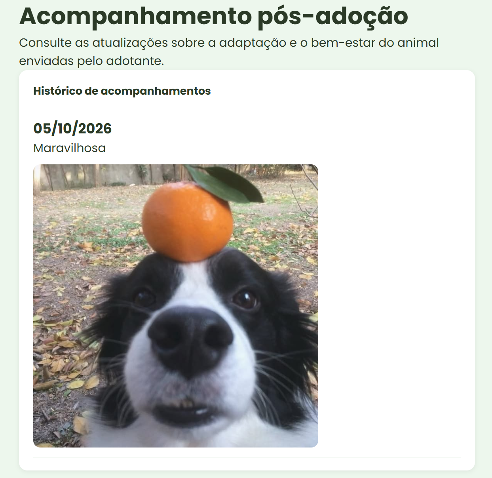
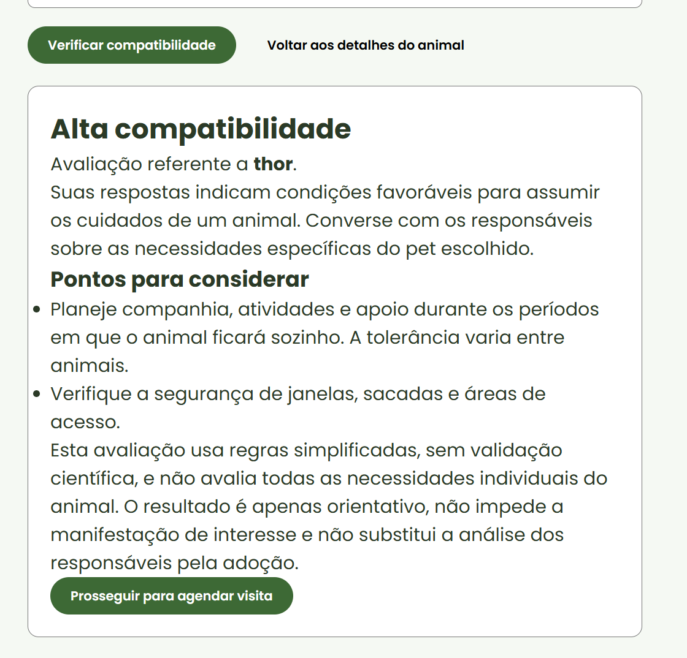
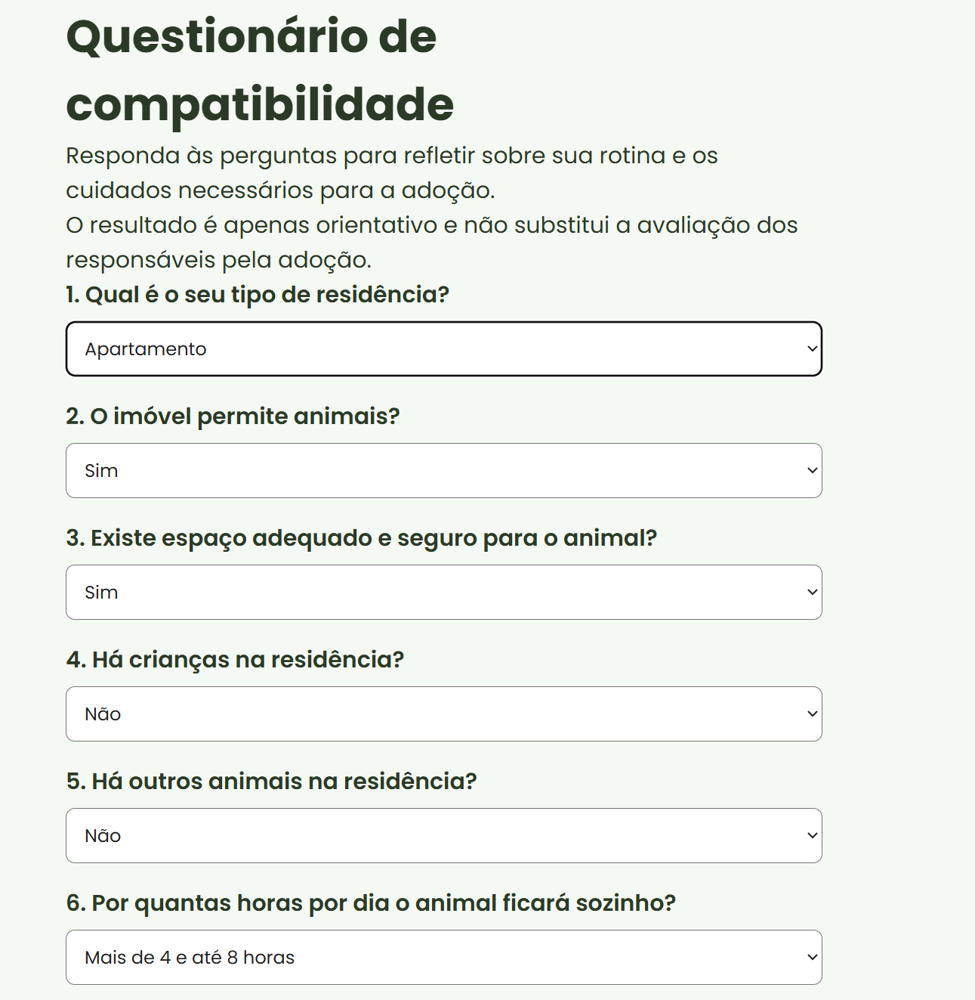

# Planejamento, Justificativa e Registro da Manutenção Evolutiva — WhiskerWorld

## 1. Identificação do sistema

O **WhiskerWorld** é um sistema web voltado ao gerenciamento de adoção de animais. A plataforma permite o cadastro e a visualização de animais, autenticação de usuários, manifestação de interesse, agendamento de visitas e gerenciamento administrativo.

Este documento reúne o planejamento das duas funcionalidades, a justificativa de sua inclusão e o registro da implementação, no diretório `docs/tp4-manutencao-evolutiva/`.

**Responsável:** [Preencher nome]  
**Data da atualização:** 05/10/2026  
**Situação:** implementação integrada à `main`, conforme confirmação da responsável; evidências e validações individuais a completar.  
**Pull request:** [Adicionar número e link]  
**Commit de integração:** [Adicionar hash e link]

## 2. Objetivo

O planejamento definiu duas novas funcionalidades para a manutenção evolutiva:

1. Questionário de compatibilidade para adoção;
2. Acompanhamento pós-adoção.

As funcionalidades ampliam o escopo do produto e têm como finalidade melhorar a experiência dos usuários. Sua motivação é adicionar capacidades ao sistema, e não corrigir defeitos existentes.

As seções 3 a 7 registram os requisitos planejados. As seções seguintes descrevem as decisões e o comportamento implementado, os arquivos envolvidos e os espaços para evidências. A integração à `main` não representa, por si só, aprovação de todos os critérios de aceitação.

## 3. Funcionalidade 1 — Questionário de compatibilidade para adoção

### 3.1 Descrição planejada

Desenvolver um questionário para auxiliar o adotante a refletir sobre a compatibilidade de sua rotina e condições com os cuidados necessários para o animal escolhido. As perguntas abrangem moradia, disponibilidade de tempo, condições financeiras, crianças, outros animais e experiência anterior. O sistema deve apresentar um resultado de compatibilidade.

### 3.2 Necessidade identificada

Antes desta evolução, o usuário podia demonstrar interesse sem uma avaliação inicial sobre sua capacidade de atender às necessidades do pet. A ausência dessa reflexão pode contribuir para solicitações inadequadas e para desistências ou devoluções. Esses riscos motivam a funcionalidade; não foi realizada uma medição de redução dessas ocorrências.

### 3.3 Justificativa

A inclusão do questionário oferece uma etapa de reflexão sobre as responsabilidades da adoção antes de o usuário prosseguir no fluxo. Seu caráter orientativo preserva a decisão e a avaliação dos responsáveis pela adoção.

Trata-se de manutenção evolutiva porque adiciona ao sistema uma capacidade que não existia: coletar respostas sobre a preparação do adotante e apresentar orientações a partir delas. Não se trata de corrigir uma falha do fluxo original.

### 3.4 Atores envolvidos

- Adotante: responde ao questionário e consulta o resultado.
- Administrador: mantém a responsabilidade pela avaliação da adoção; não foi criada uma tela administrativa de resultados do questionário.

### 3.5 Fluxo principal planejado

1. O adotante acessa os detalhes de um animal.
2. O sistema apresenta a opção **Verificar compatibilidade**.
3. O adotante inicia o questionário.
4. O sistema apresenta as perguntas.
5. O adotante responde e envia.
6. O sistema valida as respostas.
7. O sistema calcula e apresenta o resultado.
8. O adotante pode voltar aos detalhes ou prosseguir para a manifestação de interesse.

Na implementação, o prosseguimento utiliza o agendamento de visita já existente no projeto.

### 3.6 Perguntas planejadas

- Qual é o tipo de residência do adotante?
- O imóvel permite animais?
- Existe espaço adequado para o animal?
- Há crianças na residência?
- Há outros animais na residência?
- Por quantas horas o animal ficará sozinho?
- Existe disponibilidade para passeios e cuidados diários?
- Existe disponibilidade financeira para alimentação e atendimento veterinário?
- O adotante possui experiência anterior com animais?
- Todos os moradores concordam com a adoção?

### 3.7 Regras de negócio

- Relacionar o questionário ao animal selecionado.
- Exigir todas as perguntas obrigatórias.
- Apresentar **Alta**, **Média** ou **Baixa compatibilidade**.
- Apresentar uma breve orientação.
- Não bloquear automaticamente a solicitação em caso de resultado baixo.
- Informar que o resultado é orientativo.
- Não substituir a análise do administrador.

### 3.8 Critérios de aceitação

- [x] A opção **Verificar compatibilidade** está disponível nos detalhes do animal.
- [x] Todas as perguntas planejadas são apresentadas.
- [x] As perguntas obrigatórias são validadas.
- [x] O resultado é calculado e apresentado após o envio.
- [x] O resultado informa o nível de compatibilidade.
- [x] O sistema informa que o resultado é orientativo.
- [x] O adotante consegue voltar aos detalhes do animal.
- [x] O adotante consegue prosseguir para a manifestação de interesse pelo agendamento.
- [x] A funcionalidade não interfere no fluxo atual de solicitação de adoção.

### 3.9 Verificação planejada

- Respostas de alta, média e baixa compatibilidade.
- Tentativa de envio com perguntas obrigatórias vazias.
- Mensagem orientativa.
- Navegação entre questionário e detalhes do animal.

## 4. Funcionalidade 2 — Acompanhamento pós-adoção

### 4.1 Descrição planejada

Desenvolver uma área na qual o adotante registra atualizações sobre adaptação e bem-estar do animal adotado. Cada atualização deve conter descrição, data e fotografia opcional. O administrador deve poder visualizar os registros.

### 4.2 Necessidade identificada

Antes desta evolução, o sistema não disponibilizava um recurso específico para registrar informações sobre o animal após a adoção. Também foi necessário estruturar a conclusão da adoção para vincular o acompanhamento ao adotante correto; confirmar uma visita não equivale a concluir uma adoção.

### 4.3 Justificativa

O acompanhamento amplia a atuação do sistema para o período posterior à adoção. O histórico permite consultar informações enviadas pelo adotante sobre a adaptação e os cuidados com o animal e apoia o acompanhamento pela organização responsável.

Trata-se de manutenção evolutiva porque acrescenta novos registros, interfaces e consultas. O benefício esperado é apoiar o bem-estar animal; sua efetividade não foi medida em uma avaliação com usuários.

### 4.4 Atores envolvidos

- Adotante: registra atualizações e consulta seu histórico.
- Administrador: conclui a adoção e consulta os acompanhamentos.

### 4.5 Fluxo principal planejado e adequação ao sistema

1. O administrador confirma o agendamento e registra a conclusão da adoção.
2. A adoção aprovada aparece na área do adotante.
3. O adotante seleciona **Registrar acompanhamento**.
4. O sistema apresenta o formulário.
5. O adotante informa a data, escreve a atualização e pode adicionar uma fotografia.
6. O sistema valida e salva os dados.
7. A atualização aparece no histórico pós-adoção.
8. O administrador pode consultar o acompanhamento.

### 4.6 Dados do acompanhamento

- Identificação da adoção.
- Identificação do animal.
- Identificação do adotante.
- Data do acompanhamento.
- Descrição da adaptação.
- Fotografia opcional.
- Data de criação do registro.

### 4.7 Regras de negócio

- Exigir autenticação.
- Permitir cadastro somente ao adotante vinculado a uma adoção aprovada.
- Exigir descrição.
- Tornar a fotografia opcional.
- Validar formato e tamanho da imagem.
- Exibir os registros em ordem cronológica.
- Restringir o adotante aos próprios acompanhamentos.
- Permitir consulta pelo administrador.
- Não modificar o status da adoção ao registrar uma atualização.

### 4.8 Critérios de aceitação

- [x] A funcionalidade está disponível somente para adoções aprovadas.
- [x] O adotante consegue registrar uma atualização.
- [x] A descrição é obrigatória.
- [x] É possível adicionar uma fotografia opcional.
- [x] Os dados são armazenados corretamente.
- [x] As atualizações aparecem em ordem cronológica.
- [x] O adotante visualiza somente seus próprios registros.
- [x] O administrador consegue consultar os acompanhamentos.
- [x] Usuários não autorizados não conseguem acessar os registros.
- [x] O registro não modifica o status da adoção.

### 4.9 Verificação planejada

- Cadastro em adoção aprovada.
- Envio sem descrição.
- Envio com e sem fotografia.
- Acesso sem autenticação.
- Cadastro em adoção de outro usuário.
- Histórico pelo adotante e pelo administrador.
- Confirmação da manutenção do status da adoção.

## 5. Componentes previstos no planejamento

- Detalhes do animal.
- Perfil do adotante.
- Área administrativa.
- Formulários e rotas do frontend.
- Serviços de animais e adoções.
- Firebase.
- Autenticação e autorização.

Os nomes exatos dos arquivos e suas responsabilidades estão registrados nas seções 8 e 9.


## 6. Resultado esperado

O questionário deve auxiliar a reflexão sobre uma adoção consciente. O acompanhamento deve permitir registrar a adaptação e o bem-estar após a conclusão da adoção. Ambas as funcionalidades ampliam o escopo original do WhiskerWorld.

---

## 7.Registros Visuais








## 8. Registro da implementação — Questionário de compatibilidade

### 8.1 Necessidade e comportamento anterior

O fluxo original permitia acessar um animal e prosseguir para o agendamento de visita sem um questionário inicial sobre a rotina e as condições do adotante.

A nova funcionalidade oferece uma reflexão prévia sobre os cuidados necessários. O resultado é orientativo e não substitui a avaliação dos responsáveis pela adoção.

### 8.2 Interface e fluxo implementados

1. O adotante acessa os detalhes de um animal.
2. Seleciona a opção **Verificar compatibilidade**.
3. Responde às dez perguntas obrigatórias.
4. Envia as respostas para a API.
5. O sistema valida o animal e as respostas e calcula o resultado.
6. A tela apresenta o nível de compatibilidade e as orientações.
7. O adotante pode voltar aos detalhes ou prosseguir para o agendamento de visita, utilizado pelo fluxo atual do projeto.

O questionário está associado ao animal selecionado pela identificação presente na rota. As respostas são avaliadas pela API; não foi implementada uma coleção para armazenar o histórico de questionários.

### 8.3 Perguntas

| Campo | Informação solicitada |
| --- | --- |
| `tipoMoradia` | Tipo de residência |
| `permiteAnimais` | Permissão para animais no imóvel |
| `espacoAdequado` | Espaço adequado e seguro |
| `temCriancas` | Presença de crianças |
| `outrosAnimais` | Presença de outros animais |
| `horasSozinho` | Tempo diário que o animal ficará sozinho |
| `cuidadosDiarios` | Disponibilidade para cuidados e passeios |
| `condicoesFinanceiras` | Recursos para alimentação e atendimento veterinário |
| `experiencia` | Experiência anterior com animais |
| `concordancia` | Concordância dos moradores com a adoção |

### 8.4 Validações e resultado

- Todas as perguntas são obrigatórias no formulário.
- A API valida os valores aceitos para cada resposta.
- A existência do animal é verificada antes da avaliação.
- O envio utiliza autenticação.
- O formulário impede novos envios enquanto uma avaliação está em andamento.
- Alterar uma resposta limpa o resultado anterior.
- O resultado não bloqueia automaticamente o agendamento.

O cálculo utiliza seis perguntas pontuadas de zero a dois pontos: permissão para animais, espaço adequado, horas sozinho, cuidados diários, condições financeiras e concordância dos moradores. A pontuação máxima é 12.

| Pontuação | Resultado |
| --- | --- |
| 10 a 12 | Alta compatibilidade |
| 6 a 9 | Média compatibilidade |
| 0 a 5 | Baixa compatibilidade |

Respostas negativas em condições essenciais — permissão no imóvel, espaço adequado, cuidados, condições financeiras ou concordância — levam a baixa compatibilidade, mesmo quando a soma seria maior. Tipo de moradia, presença de crianças, outros animais e experiência são perguntas contextuais, sem penalização automática.

O cálculo é uma regra orientativa do projeto, sem validação científica. A associação ao animal não significa que a pontuação considere um perfil individual de necessidades de cada pet.

### 8.5 Arquivos envolvidos

| Arquivo | Responsabilidade |
| --- | --- |
| `client/src/pages/CompatibilidadePage.jsx` | Perguntas, envio, mensagens, resultado e navegação |
| `client/src/pages/AnimalDetailPage.jsx` | Entrada para o questionário |
| `client/src/services/compatibilidadeService.js` | Comunicação autenticada com a API |
| `client/src/App.jsx` | Rota protegida do questionário |
| `backend/src/services/compatibilidadeService.js` | Validação das respostas e cálculo |
| `backend/src/controllers/compatibilidadeController.js` | Recebimento da requisição e verificação do animal |
| `backend/src/routes/compatibilidade.js` | Endpoint autenticado |
| `backend/server.js` | Registro da rota e tratamento de erros |
| `client/vite.config.js` | Proxy da funcionalidade |

### 8.6 Rotas

| Camada | Método | Caminho |
| --- | --- | --- |
| Interface | Navegação | `/animal/:animalId/compatibilidade` |
| API | POST | `/compatibilidade/:animalId` |

Exemplo de corpo enviado:

```json
{
  "respostas": {
    "tipoMoradia": "casa",
    "permiteAnimais": "sim",
    "espacoAdequado": "sim",
    "temCriancas": "nao",
    "outrosAnimais": "nao",
    "horasSozinho": "ate4",
    "cuidadosDiarios": "sim",
    "condicoesFinanceiras": "sim",
    "experiencia": "sim",
    "concordancia": "sim"
  }
}
```

## 9. Registro da implementação — Acompanhamento pós-adoção

### 9.1 Necessidade e comportamento anterior

O sistema não disponibilizava um histórico estruturado de atualizações sobre a adaptação do animal após a adoção.

Para viabilizar o acompanhamento, também foi implementado o registro de conclusão da adoção. A confirmação de uma visita e a conclusão da adoção são ações diferentes.

### 9.2 Conclusão da adoção pelo administrador

1. O administrador confirma o agendamento.
2. Seleciona **Concluir adoção** e confirma a ação.
3. A API verifica sua autenticação, perfil e vínculo com o animal.
4. Uma transação no Firestore registra a adoção, altera o animal para `ADOTADO` e vincula o agendamento à adoção.
5. O painel atualiza os animais e apresenta **Adoção concluída**.

A transação exige um agendamento `CONFIRMADO`, um animal existente e pertencente ao administrador. A implementação utiliza o ID do animal como ID do documento de adoção para evitar duplicidade. Um novo ciclo de adoção para o mesmo animal exigiria uma evolução desse modelo.

### 9.3 Fluxo do adotante

1. A adoção registrada aparece em **Minhas adoções**.
2. O adotante seleciona **Registrar acompanhamento**.
3. Informa a data, uma descrição e, opcionalmente, uma fotografia.
4. O sistema valida e salva os dados.
5. A atualização aparece no histórico em ordem cronológica, do registro com data mais antiga ao mais recente.

A descrição é obrigatória, aceita até 5.000 caracteres e não pode conter apenas espaços. A data deve estar no formato `AAAA-MM-DD` e representar uma data válida. A implementação atual não adiciona restrições de data futura ou anterior à adoção.

### 9.4 Consulta pelo administrador

No painel administrativo, o botão **Ver acompanhamentos** abre o histórico da adoção. A mesma página é reutilizada para ambos os perfis, mas o formulário de cadastro aparece somente para o adotante.

Na API, administradores podem consultar o histórico de qualquer adoção aprovada. A entrada no painel atual ocorre pelos agendamentos listados para esse administrador; não foi criada uma listagem administrativa global de todas as adoções.

### 9.5 Autenticação e autorização

- As rotas da API exigem token autenticado.
- Somente o adotante vinculado à adoção pode registrar atualizações.
- O adotante só pode consultar seus próprios acompanhamentos.
- O administrador pode consultar os acompanhamentos, mas não registrar uma atualização como adotante.
- O acompanhamento exige uma adoção com status `APROVADA`.
- As identificações do animal e do adotante são obtidas da adoção no backend, em vez de confiar em valores enviados pelo formulário.
- Registrar um acompanhamento não modifica o status da adoção ou do animal.

### 9.6 Fotografia opcional

- Recebimento com Multer em memória.
- Limite de uma fotografia de até 2 MB.
- Formatos aceitos: JPEG, PNG e WebP.
- Validação no frontend, no middleware e da assinatura inicial do arquivo no serviço.
- Nome gerado com UUID, sem utilizar o nome original como caminho de armazenamento.
- Armazenamento sem chamada a `makePublic()`.
- Geração de URL assinada válida por 15 minutos, após autorização para consultar a adoção.
- Tentativa de exclusão da fotografia se a gravação do acompanhamento no Firestore falhar.

A validação de assinatura inicial não equivale à decodificação integral da imagem. A privacidade também depende das permissões e regras do bucket. Quem possuir uma URL assinada poderá acessar a foto durante sua validade; após expirar, é necessário atualizar o histórico para obter um novo link.

### 9.7 Dados armazenados

**Coleção `adocoes`:**

| Campo | Finalidade |
| --- | --- |
| `animal_id` | Animal adotado |
| `usuario_id` | Adotante responsável |
| `agendamento_id` | Agendamento de origem |
| `admin_id` | Administrador que concluiu a adoção |
| `nome_animal` | Nome exibido no painel |
| `nome_usuario` | Nome do adotante registrado no momento da conclusão |
| `status` | `APROVADA` |
| `data_adocao` | Data e hora da conclusão |
| `criadoEm` | Data e hora de criação |

**Coleção `acompanhamentos`:**

| Campo | Finalidade |
| --- | --- |
| `adocao_id` | Adoção vinculada |
| `animal_id` | Animal da adoção |
| `usuario_id` | Adotante responsável |
| `data_acompanhamento` | Data informada no formulário |
| `descricao` | Atualização sobre adaptação e bem-estar |
| `criadoEm` | Data e hora de criação |
| `foto_caminho` | Caminho no Storage, quando há fotografia |
| `foto_tipo` | Tipo da imagem, quando há fotografia |

`foto_url` é gerada para a consulta e não é armazenada como endereço permanente no documento.

### 9.8 Arquivos envolvidos

| Arquivo | Responsabilidade |
| --- | --- |
| `backend/src/repositories/adocoesRepository.js` | Transação de conclusão, consulta por adotante e busca por ID |
| `backend/src/services/adocoesService.js` | Validações de conclusão e listagem |
| `backend/src/controllers/adocoesController.js` | Requisições de adoção |
| `backend/src/routes/adocoes.js` | Rotas de adoção |
| `backend/src/repositories/acompanhamentosRepository.js` | Criação e consulta cronológica do histórico |
| `backend/src/services/acompanhamentosService.js` | Autorização, validações e integração das fotografias |
| `backend/src/services/fotosAcompanhamentoService.js` | Validação da assinatura, Storage, URLs e limpeza |
| `backend/src/controllers/acompanhamentosController.js` | Cadastro e consulta de acompanhamentos |
| `backend/src/routes/acompanhamentos.js` | Endpoints autenticados |
| `backend/src/middlewares/uploadFotoAcompanhamento.js` | Recebimento e limites de upload |
| `client/src/services/adocoesService.js` | Chamadas de conclusão e listagem de adoções |
| `client/src/services/acompanhamentosService.js` | Consulta e envio com `FormData` |
| `client/src/pages/AcompanhamentoPage.jsx` | Formulário, fotografia, mensagens e histórico |
| `client/src/pages/AdotanteDashboardPage.jsx` | Seção Minhas adoções e entrada para acompanhamento |
| `client/src/pages/AdminDashboardPage.jsx` | Conclusão de adoção e consulta do histórico |
| `client/src/App.jsx` | Rotas protegidas por perfil |
| `client/vite.config.js` | Proxy das novas chamadas |
| `backend/server.js` | Registro das rotas |

### 9.9 Rotas

| Camada | Método | Caminho | Acesso |
| --- | --- | --- | --- |
| API | GET | `/adocoes/me` | Adotante autenticado |
| API | POST | `/adocoes/agendamento/:agendamentoId` | Administrador autorizado |
| API | GET | `/acompanhamentos/:adocaoId` | Adotante responsável ou administrador |
| API | POST | `/acompanhamentos/:adocaoId` | Adotante responsável |
| Interface | Navegação | `/adocoes/:adocaoId/acompanhamento` | Adotante |
| Interface | Navegação | `/admin/adocoes/:adocaoId/acompanhamento` | Administrador |

O cadastro de acompanhamento utiliza `multipart/form-data`, com os campos `data_acompanhamento`, `descricao` e `foto` opcional.


## 10. Verificação e critérios de aceitação

### 10.1 Confirmações durante o desenvolvimento

- Conexão e execução local do sistema confirmadas.
- Questionário reportado como funcional após ajustes de integração.
- Painel do adotante exibindo uma adoção aprovada, conforme captura apresentada.
- Registro de acompanhamento e sua localização no histórico confirmados pelo relato de teste.
- Arquivos preparados em um commit local na branch de desenvolvimento, conforme `git status` apresentado.

A responsável confirmou posteriormente o merge da branch na `main`. O link do pull request, o commit de integração e a saída do build devem ser anexados para completar esses registros. Os relatos gerais de funcionamento não substituem a confirmação de cada caso abaixo.

### 10.2 Testes do questionário

| ID | Caso | Resultado esperado | Resultado obtido / evidência |
| --- | --- | --- | --- |
| Q01 | Abrir pelo detalhe do animal | Questionário do animal correto | [Feito] |
| Q02 | Respostas favoráveis | Alta compatibilidade | [Feito] |
| Q03 | Respostas intermediárias | Média compatibilidade | [Feito] |
| Q04 | Respostas desfavoráveis | Baixa compatibilidade | [Feito] |
| Q05 | Pergunta obrigatória vazia | Envio impedido | [Feito] |
| Q06 | Valor de resposta inválido enviado à API | Rejeição com erro de validação | [Feito] |
| Q07 | Consultar o resultado | Mensagem orientativa disponível | [Feito] |
| Q08 | Voltar aos detalhes | Retorno ao animal selecionado | [Feito] |
| Q09 | Prosseguir com resultado baixo | Agendamento continua permitido | [Feito] |
| Q10 | Alterar resposta após resultado | Resultado anterior limpo | [Feito] |

### 10.3 Testes de adoção e acompanhamento

| ID | Caso | Resultado esperado | Resultado obtido / evidência |
| --- | --- | --- | --- |
| A01 | Concluir agendamento confirmado | Adoção criada e animal `ADOTADO` | [Feito] |
| A02 | Concluir agendamento pendente | Operação rejeitada | [Feito] |
| A03 | Concluir novamente o mesmo animal | Duplicidade rejeitada | [Feito] |
| A04 | Administrador sem vínculo com animal conclui adoção | Acesso rejeitado | [Feito] |
| A05 | Listar minhas adoções | Somente adoções do usuário | Adoção exibida; isolamento entre usuários pendente |
| P01 | Registrar acompanhamento em adoção aprovada | Registro criado no histórico | Funcionamento relatado; anexar evidência |
| P02 | Enviar sem descrição ou apenas espaços | Cadastro rejeitado | [Feitor] |
| P03 | Registrar sem foto | Cadastro permitido | [Feito] |


### 10.4 Compilação e evidências técnicas

Na pasta `client`:

```bash
npm run build
```

## 11. Ajustes de integração e problemas resolvidos

- Correção do proxy de `/compatibilidade` no arquivo efetivamente utilizado pelo Vite, após respostas `404 Not Found` no frontend.
- Separação entre o arquivo de configuração do Vite e o de testes Vitest.
- Registro das rotas de compatibilidade, adoções e acompanhamentos no servidor e no proxy local.
- Inclusão de tratamento centralizado de erros compatível com a propriedade `status` de `AppError`.
- Correção de nomes e exportações entre repositórios, serviços e controllers de adoção.
- Correção de JSX: elementos dentro do `.map`, fechamento dos eventos e condição de exibição do formulário para adotantes.
- Preservação das seções existentes nos painéis ao adicionar as funcionalidades.
- Orientação para ignorar `client/dist/`, gerada pelo build, no `.gitignore`.


## 13. Comparação entre antes e depois

| Aspecto | Antes | Depois |
| --- | --- | --- |
| Reflexão prévia à adoção | Sem questionário | Dez perguntas com resultado orientativo |
| Resultado de compatibilidade | Ausente | Alta, média ou baixa, com orientações |
| Conclusão estruturada da adoção | Sem o novo registro usado pelo acompanhamento | Adoção vinculada a animal, adotante e agendamento |
| Área do adotante | Favoritos e agendamentos | Também apresenta Minhas adoções |
| Atualizações após adoção | Sem histórico específico | Data, descrição e fotografia opcional |
| Área administrativa | Gestão de animais e agendamentos | Também conclui adoção e abre acompanhamento |
| Fotografias do acompanhamento | Recurso ausente | Upload limitado e consulta por URL temporária |

## 14. Resultado

O questionário adiciona uma etapa orientativa sobre a preparação do adotante. O acompanhamento amplia o sistema para registrar a adaptação do animal após a adoção, com histórico e consulta administrativa.

As duas funcionalidades caracterizam manutenção evolutiva porque incorporam novas capacidades ao produto. A implementação foi construída e teve verificações locais relatadas; a conclusão da entrega depende do preenchimento das evidências e da validação dos casos pendentes.

