# Mudanças Implementadas — Redesign Whiskerworld

## 1. Objetivo

Este documento reúne as evidências da implementação das melhorias definidas no [planejamento do redesign](../../planejamento.md), elaborado a partir da [avaliação heurística](../../avaliacao-heuristica.md) do sistema.

Para cada problema (P01 a P10) são apresentados a heurística de Nielsen relacionada, o que foi alterado na interface, os arquivos modificados e as capturas de tela **antes** e **depois** da mudança.

---

## 2. Como as evidências foram geradas

- As capturas de **antes** foram feitas a partir do código original (commit `eccae9e`), e as de **depois** a partir do código com o redesign aplicado.
- As duas versões foram executadas localmente com o Vite e capturadas no Google Chrome (janela de 1280 px de largura), seguindo exatamente os mesmos passos de navegação.
- As duas versões usaram os mesmos dados de teste (4 animais, 1 favorito e 1 agendamento), para que a única diferença entre as imagens seja a interface.
- Cada pasta tem o nome da heurística de Nielsen corrigida (por exemplo, `H5-exclusao-da-conta`) e contém os arquivos `antes-*.png` e `depois-*.png` da melhoria correspondente.

---

## 3. Resumo das mudanças

| Problema | Heurística de Nielsen | Gravidade | Mudança implementada | Evidências |
|---|---|---|---|---|
| P04 | H5 — Prevenção de erros | 3 — Grave | Exclusão da conta movida para uma "Zona de perigo" e confirmação digitando `EXCLUIR` | [P04](H5-exclusao-da-conta/) |
| P10 | H9 — Recuperação de erros | 3 — Grave | Mensagem "Token inválido ou expirado." substituída por mensagem clara, com botão "Fazer login novamente" | [P10](H9-mensagem-de-erro/) |
| P01 | H3 — Controle e liberdade | 2 — Menor | Menu da conta com troca de perfil em todas as áreas autenticadas | [P01](H3-troca-de-perfil/) |
| P06 | H7 — Flexibilidade e eficiência | 2 — Menor | Opção "Ver todos os animais" e filtro de espécie na própria listagem | [P06](H7-listagem-de-animais/) |
| P07 | H7 — Flexibilidade e eficiência | 2 — Menor | Agendamento dividido em 5 etapas, com indicador de progresso e revisão final | [P07](H7-agendamento-em-etapas/) |
| P02 | H4 — Consistência e padrões | 2 — Menor | Botões de acesso aos perfis com o mesmo estilo e o mesmo padrão de texto | [P02](H4-opcoes-de-acesso/) |
| P03 | H4 — Consistência e padrões | 2 — Menor | Asterisco `*` nos campos obrigatórios e legenda em todos os formulários | [P03](H4-campos-obrigatorios/) |
| P08 | H8 — Estética e design minimalista | 2 — Menor | Estados dos campos padronizados: vazio e preenchido iguais, foco em verde, erro em vermelho | [P08](H8-estados-dos-campos/) |
| P05 | H5 — Prevenção de erros | 2 — Menor | Preview de imagem com estado vazio explicado e confirmação da imagem selecionada | [P05](H5-preview-de-imagem/) |
| P09 | H8 — Estética e design minimalista | 2 — Menor | Botão de favorito maior, com contorno, texto e estados distintos | [P09](H8-botao-de-favorito/) |

As melhorias foram implementadas na ordem definida no planejamento: primeiro as de gravidade 3 (P04 e P10) e depois as de gravidade 2.

---

## 4. Relação com as 10 Heurísticas de Nielsen

Cada mudança foi pensada para corrigir uma heurística principal, a mesma registrada na avaliação heurística. Várias delas também reforçam outras heurísticas, detalhadas na seção de cada melhoria.

| Heurística de Nielsen | Corrigida diretamente por | Também reforçada por |
|---|---|---|
| H1 — Visibilidade do status do sistema | — | P01, P05, P07, P08, P09, P10 |
| H2 — Correspondência entre o sistema e o mundo real | — | P05, P10 |
| H3 — Controle e liberdade do usuário | P01 | P04, P06, P07 |
| H4 — Consistência e padrões | P02, P03 | P01, P04, P08 |
| H5 — Prevenção de erros | P04, P05 | P03, P07 |
| H6 — Reconhecimento em vez de memorização | — | P07, P09 |
| H7 — Flexibilidade e eficiência de uso | P06, P07 | — |
| H8 — Estética e design minimalista | P08, P09 | — |
| H9 — Ajudar os usuários a reconhecer, diagnosticar e recuperar erros | P10 | — |
| H10 — Ajuda e documentação | — | — |

> H10 não aparece porque a avaliação heurística não encontrou problemas ligados a ela. H1, H2 e H6 também não tinham problemas próprios na avaliação, mas foram reforçadas pelas mudanças.

---

## 5. Evidências por melhoria

### P04 — Ação de exclusão da conta exposta no dashboard

**Heurística de Nielsen corrigida:** H5 — Prevenção de erros · **Gravidade:** 3 — Grave · **Prioridade:** Alta

**O que mudou:**

- A exclusão saiu do card comum "Minha conta" e foi para uma seção própria, **"Zona de perigo"**, no fim da página, com cores e ícone de alerta e o aviso de que a ação é permanente.
- O botão passou a se chamar "Excluir conta…". As reticências indicam que haverá uma etapa de confirmação.
- No modal de confirmação, o botão "Sim, excluir conta" só é habilitado depois que o usuário digita `EXCLUIR`. A opção "Manter minha conta" continua disponível para cancelar.
- O botão "Sair", que antes tinha o mesmo vermelho da exclusão, passou a ser neutro (cinza), para não ser confundido com uma ação destrutiva.

**Como a mudança aplica a heurística de Nielsen:**

- **H5 — Prevenção de erros (heurística corrigida):** Nielsen recomenda eliminar as condições que levam ao erro ou pedir confirmação antes de ações graves. A exclusão saiu de perto das ações comuns, o que reduz o clique por engano, e passou a exigir uma confirmação ativa (digitar `EXCLUIR`). Assim, um clique acidental não basta para apagar a conta.
- **H3 — Controle e liberdade do usuário (complementar):** a saída de emergência "Manter minha conta" continua visível no modal, então o usuário pode desistir a qualquer momento.
- **H4 — Consistência e padrões (complementar):** o vermelho passou a indicar apenas ações destrutivas. Por isso o botão "Sair" deixou de usar essa cor.

**Arquivos:** `client/src/pages/AdotanteDashboardPage.jsx`, `client/src/styles/global.css`

| Antes | Depois |
|---|---|
| 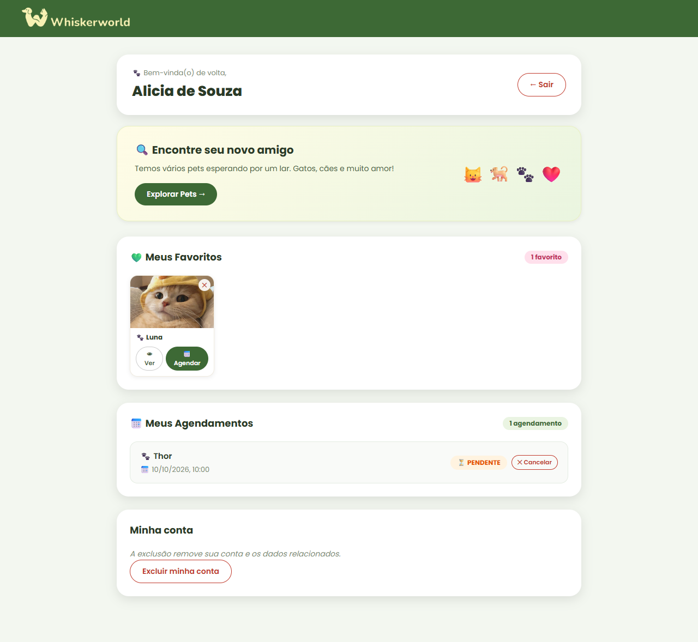 | 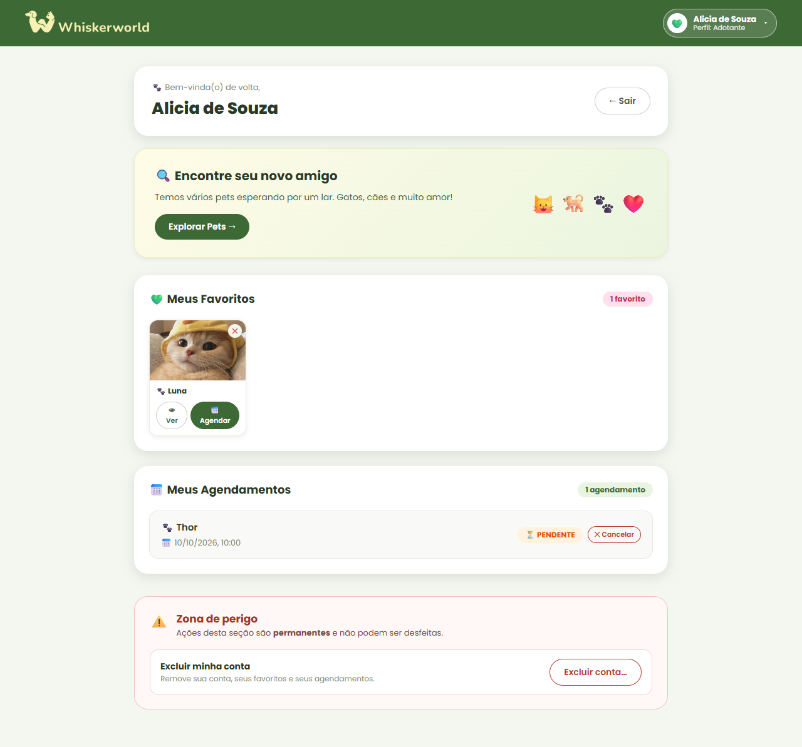 |
| 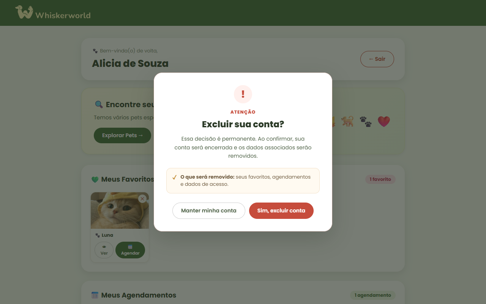 | 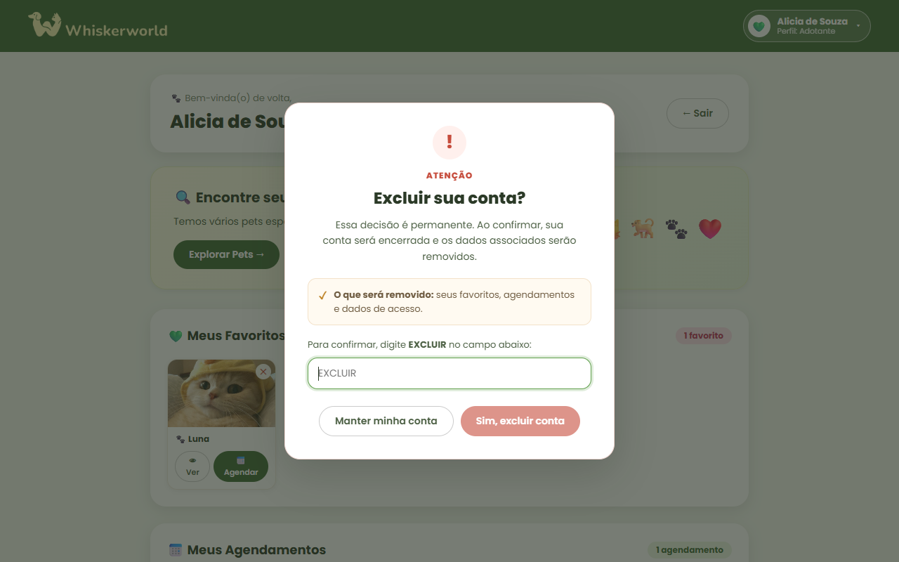 |

---

### P10 — Mensagem de erro técnica sem orientação para recuperação

**Heurística de Nielsen corrigida:** H9 — Ajudar os usuários a reconhecer, diagnosticar e recuperar erros · **Gravidade:** 3 — Grave · **Prioridade:** Alta

**O que mudou:**

- **Backend:** o middleware de autenticação não responde mais "Token inválido ou expirado." Agora responde *"Sua sessão expirou. Faça login novamente para continuar."*, com status `401` e o código `SESSAO_EXPIRADA`. Quando o usuário não está conectado, responde com o código `SESSAO_AUSENTE`.
- **Frontend:** o cliente da API identifica esses erros de sessão e os marca como "sessão expirada". O novo componente `ErroAlerta` explica o problema em linguagem simples, avisa que os dados da tela não foram enviados e oferece o botão **"Fazer login novamente"**, que leva ao login do perfil correto.

**Como a mudança aplica a heurística de Nielsen:**

- **H9 — Ajudar os usuários a reconhecer, diagnosticar e recuperar erros (heurística corrigida):** segundo Nielsen, mensagens de erro devem usar linguagem simples (sem códigos ou termos técnicos), indicar o problema com precisão e sugerir uma solução. A mensagem nova troca "token" por "sessão", explica o que aconteceu ("Sua sessão expirou"), diz o que fazer ("Faça login novamente") e oferece essa ação em um botão.
- **H2 — Correspondência entre o sistema e o mundo real (complementar):** "sessão expirada" é um termo que o usuário conhece; "token" é jargão de desenvolvimento.
- **H1 — Visibilidade do status do sistema (complementar):** o aviso "Os dados preenchidos nesta tela não foram enviados" deixa claro o que aconteceu com a operação.

**Arquivos:** `backend/src/middlewares/authMiddleware.js`, `client/src/services/api.js`, `client/src/components/ErroAlerta.jsx` (novo), `client/src/pages/AdminCadastrarAnimalPage.jsx`, `client/src/pages/AgendarVisitaPage.jsx`

| Antes | Depois |
|---|---|
| 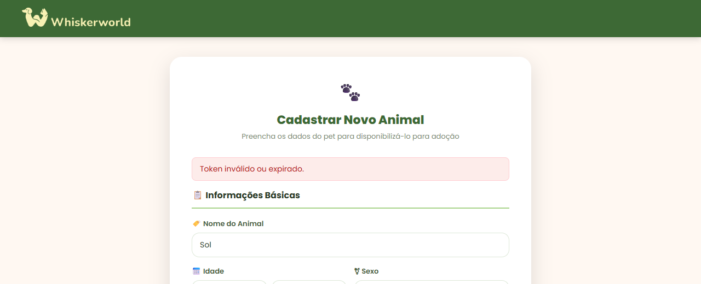 | 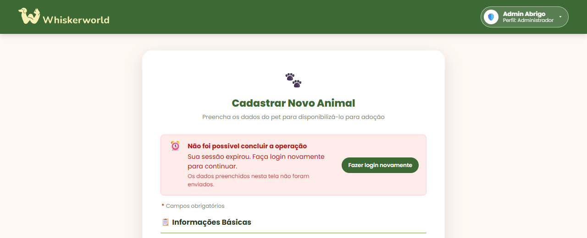 |

---

### P01 — Troca de perfil exige retorno à tela inicial

**Heurística de Nielsen corrigida:** H3 — Controle e liberdade do usuário · **Gravidade:** 2 — Menor

**O que mudou:**

- Novo componente `ContaMenu` na barra superior de todas as áreas autenticadas: dashboard do adotante, escolha de espécie, listagem, agendamento, painel do administrador e cadastro de animal.
- O menu mostra o nome do usuário e o **perfil atual**, e oferece "Minha área", **"Trocar para perfil Administrador/Adotante"** (que leva direto ao login do outro perfil) e "Sair da conta".

**Como a mudança aplica a heurística de Nielsen:**

- **H3 — Controle e liberdade do usuário (heurística corrigida):** Nielsen recomenda que o usuário consiga sair de um contexto sem passar por um caminho longo. A troca de perfil agora fica a um clique, de qualquer área autenticada, sem voltar à tela inicial.
- **H1 — Visibilidade do status do sistema (complementar):** o menu mostra sempre o perfil atual ("Perfil: Adotante" ou "Perfil: Administrador"), então o usuário sabe em que contexto está.
- **H4 — Consistência e padrões (complementar):** o menu da conta fica no canto superior direito, padrão comum em aplicações web.

**Arquivos:** `client/src/components/ContaMenu.jsx` (novo), `client/src/components/Navbar.jsx`, `client/src/pages/AnimaisListPage.jsx`, `client/src/pages/AgendarVisitaPage.jsx`

| Antes | Depois |
|---|---|
| 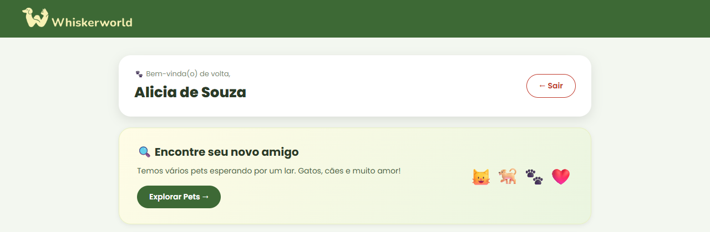 | 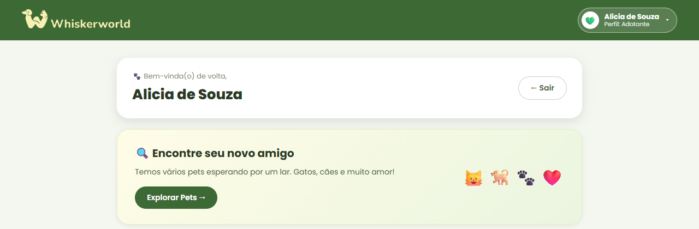 |
| 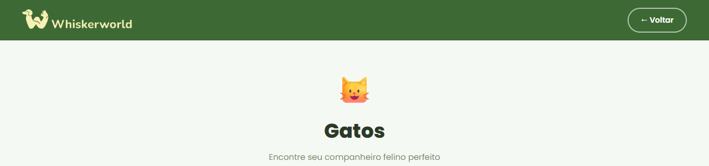 | 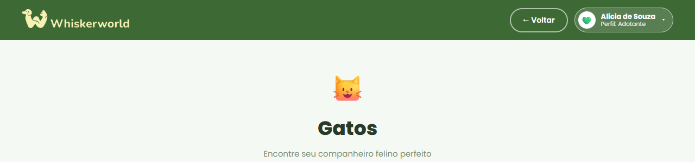 |
| — | 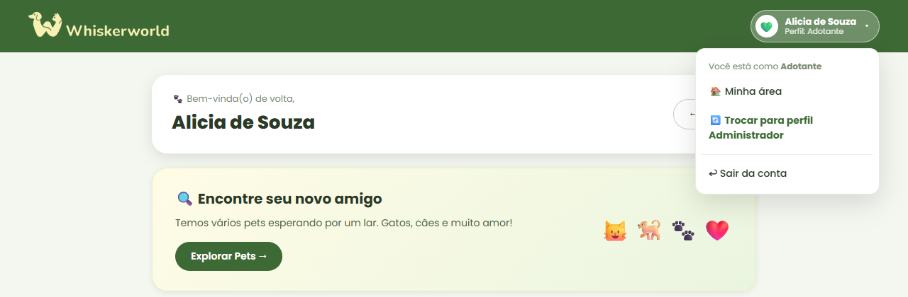 |

---

### P06 — Navegação da listagem depende da seleção de espécie

**Heurística de Nielsen corrigida:** H7 — Flexibilidade e eficiência de uso · **Gravidade:** 2 — Menor

**O que mudou:**

- A tela "O que você procura?" ganhou a opção em destaque **"Ver todos os animais"**. Os cards de Gatos e Cães continuam disponíveis logo abaixo ("ou escolha uma espécie").
- Nova rota `/animais/TODOS`, que lista todas as espécies.
- A listagem ganhou o filtro **Espécie (Todos / Gatos / Cães)**, para trocar de espécie sem voltar à tela anterior.
- Os botões "Ver Gatos" (laranja) e "Ver Cães" (azul) passaram a usar o mesmo estilo, seguindo também o P02.

**Como a mudança aplica a heurística de Nielsen:**

- **H7 — Flexibilidade e eficiência de uso (heurística corrigida):** Nielsen recomenda oferecer mais de um caminho, para que cada usuário escolha o mais eficiente. Quem só quer ver os animais disponíveis chega à lista direto, e quem procura uma espécie continua podendo filtrar. O filtro dentro da listagem também evita voltar à tela anterior para trocar de espécie.
- **H3 — Controle e liberdade do usuário (complementar):** escolher uma espécie deixou de ser obrigatório para começar a explorar.

**Arquivos:** `client/src/pages/EscolhaAnimalPage.jsx`, `client/src/pages/AnimaisListPage.jsx`

| Antes | Depois |
|---|---|
| 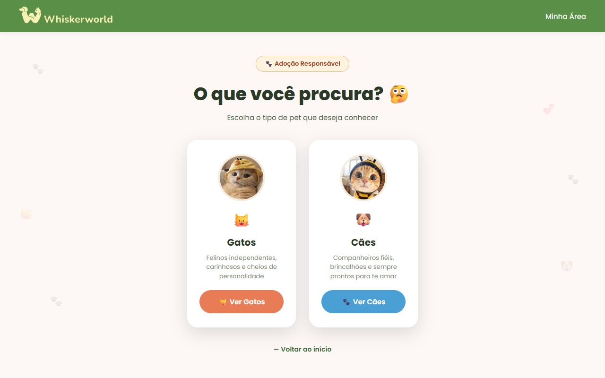 | 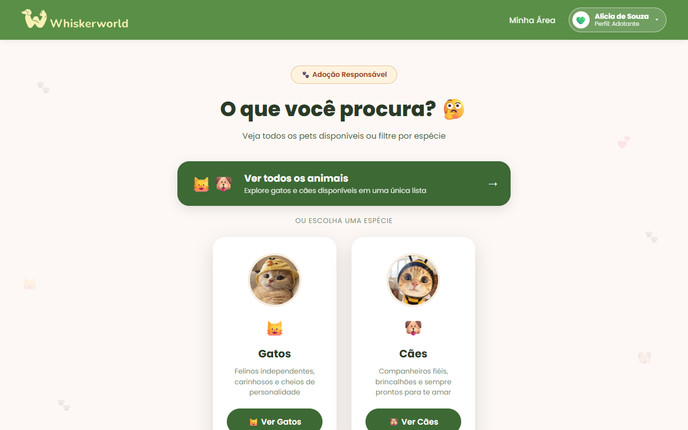 |
| — | 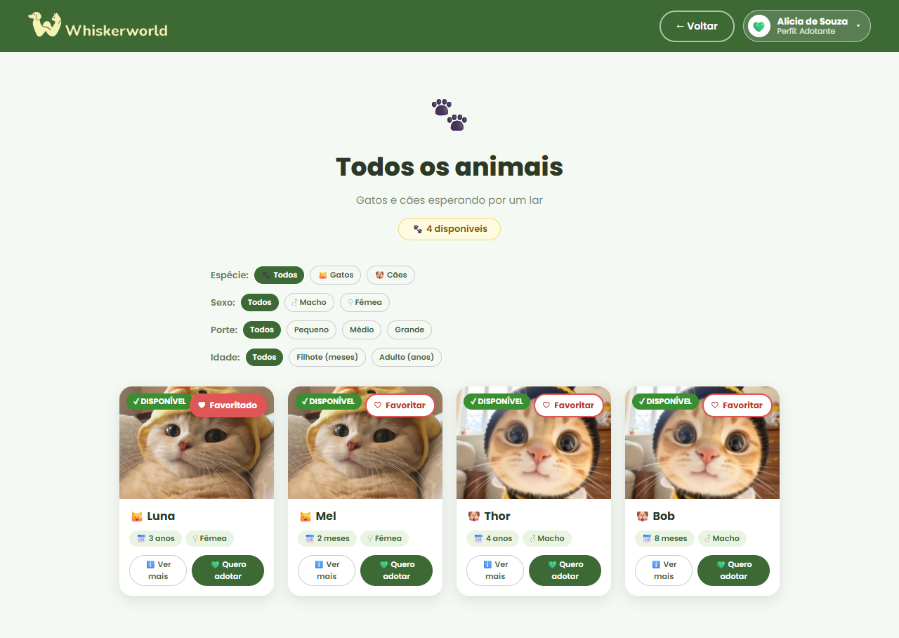 |

---

### P07 — Formulário de agendamento extenso e sem divisão em etapas

**Heurística de Nielsen corrigida:** H7 — Flexibilidade e eficiência de uso · **Gravidade:** 2 — Menor

**O que mudou:**

- O formulário único foi dividido em **5 etapas**: Seus dados → Residência e rotina → Cuidados → Data e horário → Revisão.
- Um indicador de progresso (*stepper*) mostra as etapas concluídas (✓), a etapa atual e o texto "Etapa X de 5".
- Ao clicar em "Próximo", os campos obrigatórios da etapa são validados antes de avançar. "Etapa anterior" permite voltar sem perder os dados.
- A última etapa mostra um **resumo de todas as respostas**, com um botão "Editar" para cada grupo, antes de "Confirmar Agendamento".
- Os campos e os dados enviados à API continuam os mesmos.

**Como a mudança aplica a heurística de Nielsen:**

- **H7 — Flexibilidade e eficiência de uso (heurística corrigida):** dividir o formulário em grupos menores reduz o esforço de cada passo e deixa o processo mais fácil de concluir.
- **H1 — Visibilidade do status do sistema (complementar):** o indicador de etapas e o texto "Etapa X de 5" mostram o progresso o tempo todo.
- **H5 — Prevenção de erros (complementar):** os campos obrigatórios são validados em cada etapa, e a revisão final permite conferir tudo antes do envio.
- **H6 — Reconhecimento em vez de memorização (complementar):** a revisão final mostra todas as respostas na tela, então o usuário não precisa lembrar o que preencheu nas etapas anteriores.
- **H3 — Controle e liberdade do usuário (complementar):** "Etapa anterior" e os botões "Editar" permitem voltar e corrigir sem perder dados.

**Arquivos:** `client/src/pages/AgendarVisitaPage.jsx`, `client/src/styles/global.css`

| Antes | Depois |
|---|---|
| 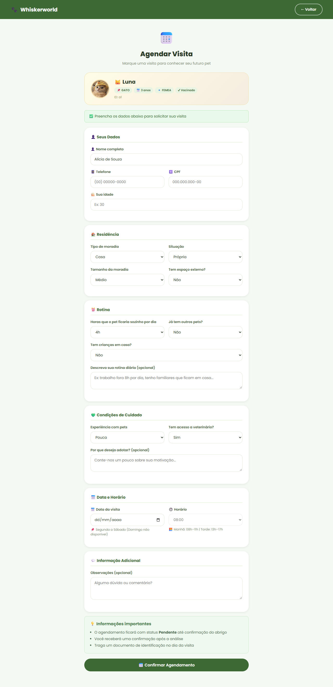 | 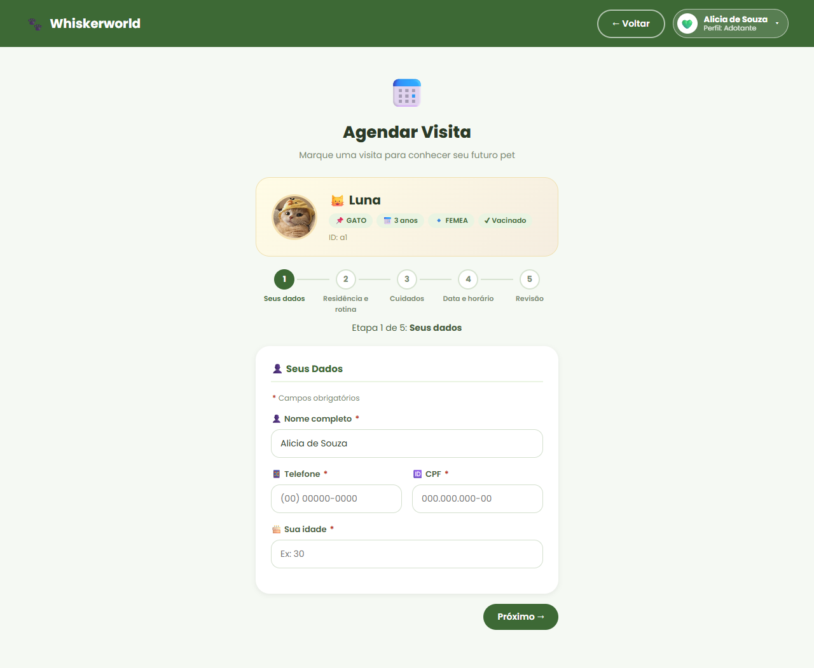 |
| | 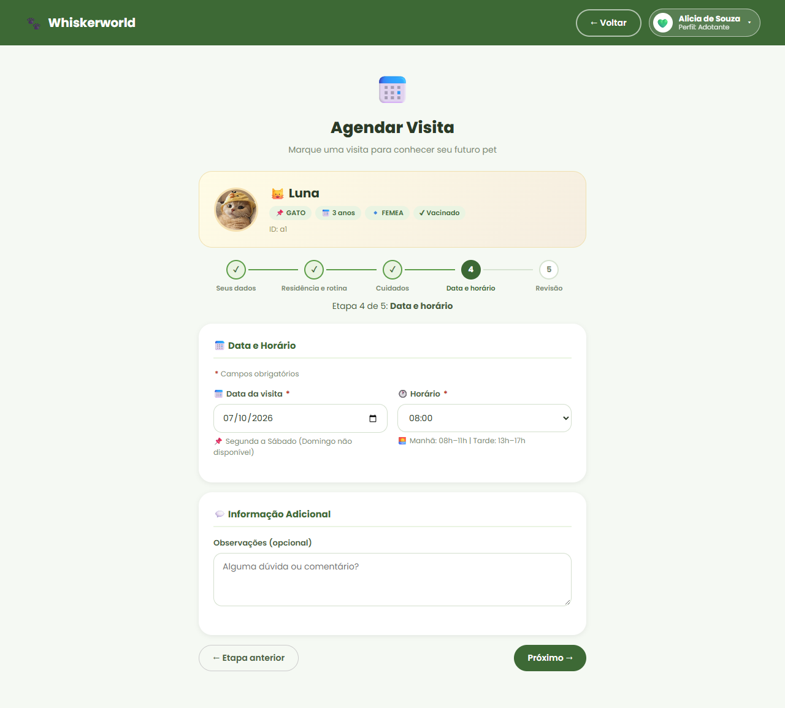 |
| | 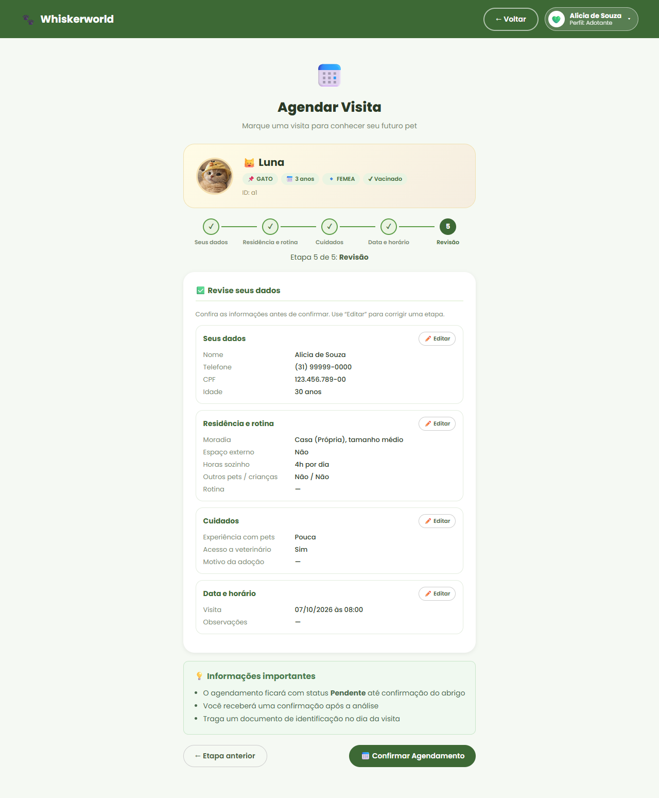 |

---

### P02 — Diferença visual entre as opções de acesso aos perfis

**Heurística de Nielsen corrigida:** H4 — Consistência e padrões · **Gravidade:** 2 — Menor

**O que mudou:**

- Na tela inicial, os botões "Encontrar Pets" (verde) e "Acessar Painel" (laranja) foram substituídos por **"Entrar como Adotante →"** e **"Entrar como Administrador →"**, com o mesmo estilo e o mesmo padrão de texto.
- O login e o cadastro usam o mesmo botão para os dois perfis, e o painel lateral do login do administrador deixou de ser laranja.
- A diferença entre os perfis ficou apenas onde ela é necessária para identificá-los: ícone, título e selo "Área do Administrador/Adotante".

**Como a mudança aplica a heurística de Nielsen:**

- **H4 — Consistência e padrões (heurística corrigida):** Nielsen recomenda que elementos com a mesma função tenham a mesma aparência, para o usuário não precisar se perguntar se são coisas diferentes. Os dois botões de acesso agora têm o mesmo estilo e o mesmo padrão de texto ("Entrar como…"), então são percebidos como alternativas equivalentes. O que diferencia os perfis (ícone, título e selo) continua visível, porque essa diferença tem significado.

**Arquivos:** `client/src/pages/HomePage.jsx`, `client/src/pages/LoginPage.jsx`, `client/src/pages/CadastroPage.jsx`, `client/src/styles/global.css`

| Antes | Depois |
|---|---|
| 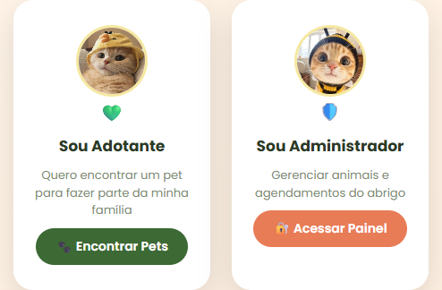 | 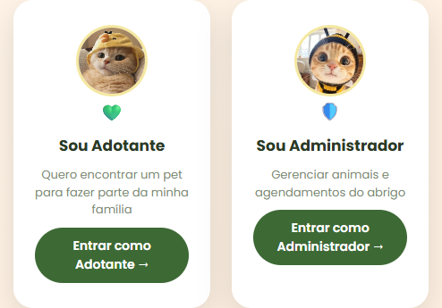 |
| 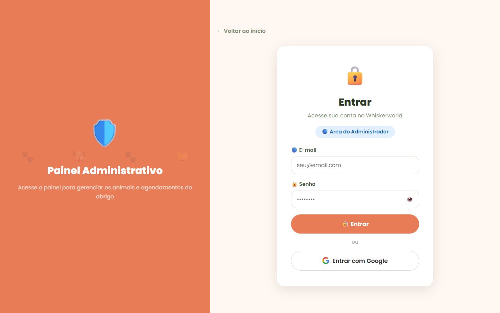 | 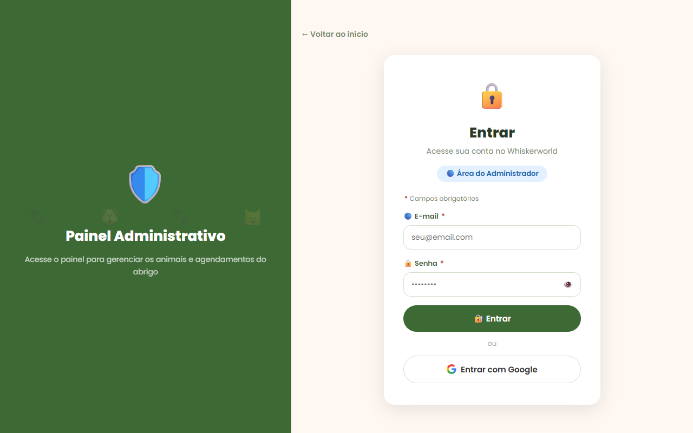 |

---

### P03 — Campos obrigatórios sem indicação visual padronizada

**Heurística de Nielsen corrigida:** H4 — Consistência e padrões · **Gravidade:** 2 — Menor

**O que mudou:**

- Os campos obrigatórios passaram a ter um asterisco vermelho (`*`) no rótulo, e cada formulário ganhou a legenda **"\* Campos obrigatórios"**.
- O padrão foi aplicado no login, no cadastro de adotante, no cadastro de animal e no agendamento.
- Também foi corrigido o ícone quebrado (`�`) do campo "Porte".

**Como a mudança aplica a heurística de Nielsen:**

- **H4 — Consistência e padrões (heurística corrigida):** o asterisco é uma convenção conhecida na web, e agora é usado da mesma forma em todos os formulários do sistema, com a mesma legenda.
- **H5 — Prevenção de erros (complementar):** o usuário vê quais campos são obrigatórios antes de enviar, em vez de descobrir só pela mensagem de erro.

**Arquivos:** `client/src/pages/LoginPage.jsx`, `client/src/pages/CadastroPage.jsx`, `client/src/pages/AdminCadastrarAnimalPage.jsx`, `client/src/pages/AgendarVisitaPage.jsx`, `client/src/styles/global.css`

| Antes | Depois |
|---|---|
| 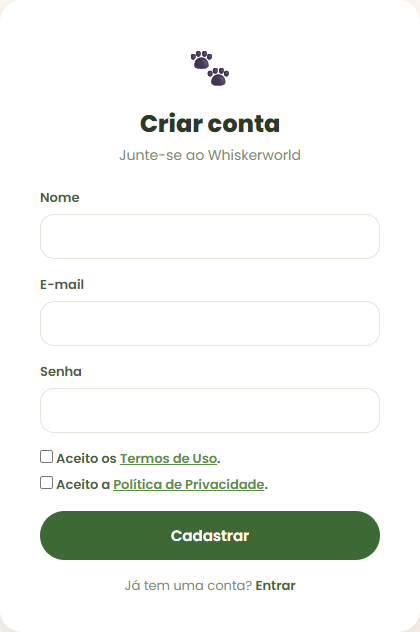 | 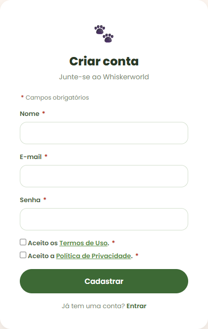 |
| 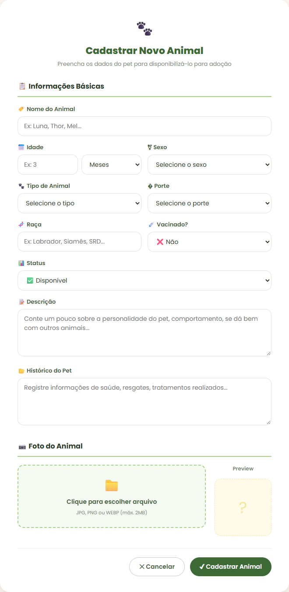 | 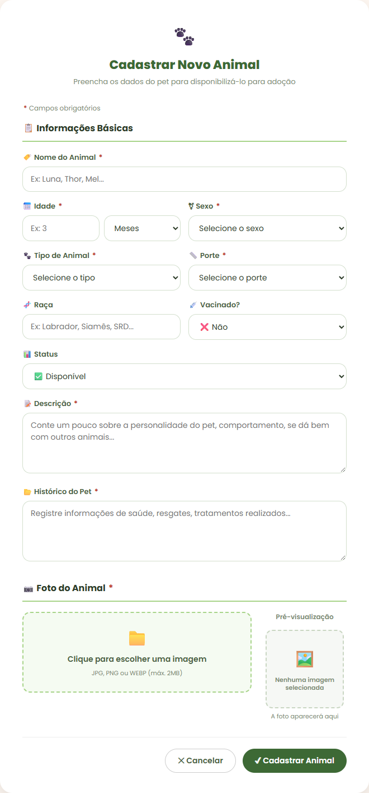 |

---

### P08 — Estado visual dos campos preenchidos pode gerar dúvida

**Heurística de Nielsen corrigida:** H8 — Estética e design minimalista · **Gravidade:** 2 — Menor

**O que mudou:**

- O fundo azul que o navegador aplica aos campos preenchidos automaticamente (*autofill*), registrado na evidência original [`h03-cadastro-inputs.png`](../h03-cadastro-inputs.png), foi neutralizado. Campos vazios e preenchidos agora têm a mesma aparência.
- Ficaram definidos só os estados com significado: **foco** (borda e brilho verdes), **erro** (borda vermelha, aplicada apenas depois que o usuário interage ou tenta enviar) e **desabilitado** (fundo cinza).

**Como a mudança aplica a heurística de Nielsen:**

- **H8 — Estética e design minimalista (heurística corrigida):** segundo Nielsen, cada informação visual extra compete com as que importam. O fundo azul não tinha significado para o usuário e foi removido. Agora só aparecem variações visuais com função: foco, erro e desabilitado.
- **H1 — Visibilidade do status do sistema (complementar):** a borda verde mostra qual campo está ativo, e a borda vermelha mostra qual campo precisa de correção.
- **H4 — Consistência e padrões (complementar):** todos os formulários usam o mesmo conjunto de estados.

**Arquivos:** `client/src/styles/global.css`

> Observação: o fundo azul só aparece quando o navegador preenche os campos automaticamente (*autofill*). Por isso, o "antes" desse problema usa a evidência original da avaliação heurística (`h03`). As capturas abaixo mostram, após uma tentativa de envio, o foco no campo "Raça" e os campos obrigatórios não preenchidos.

| Antes | Depois |
|---|---|
| 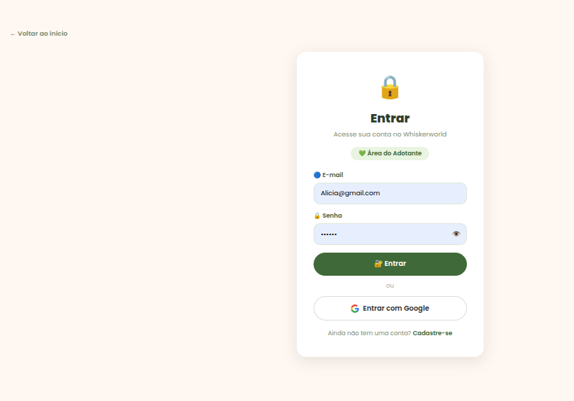 | 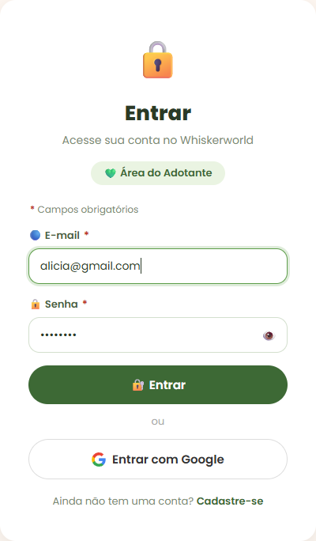 |
| 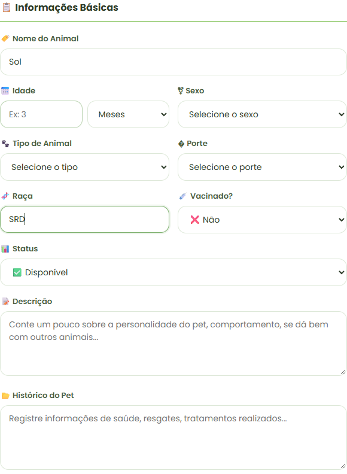 | 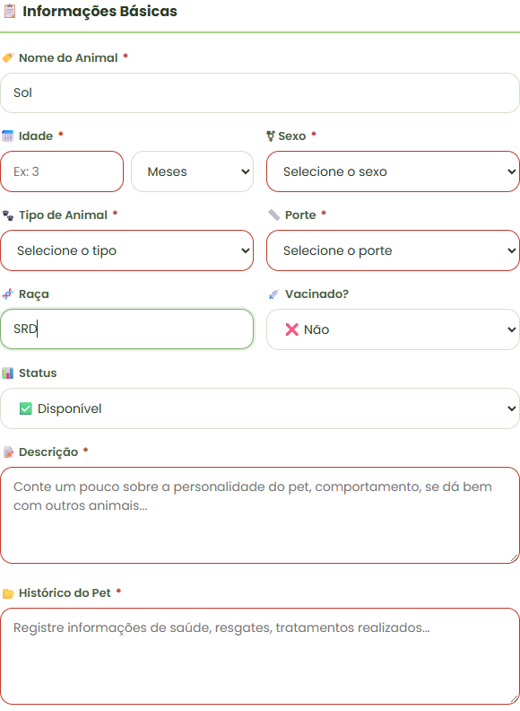 |

---

### P05 — Estado pouco claro no preview de imagem do cadastro de animal

**Heurística de Nielsen corrigida:** H5 — Prevenção de erros · **Gravidade:** 2 — Menor

**O que mudou:**

- O quadro amarelo com "?" foi substituído por um estado vazio que explica a situação: ícone de imagem, "Nenhuma imagem selecionada" e "A foto aparecerá aqui".
- Com uma imagem carregada, o preview ganha borda verde, a confirmação **"✓ Imagem selecionada"** e o nome do arquivo. A área de upload muda para "Clique para trocar a imagem".
- A área de upload também pode ser acionada pelo teclado (Enter ou Espaço).

**Como a mudança aplica a heurística de Nielsen:**

- **H5 — Prevenção de erros (heurística corrigida):** o estado vazio agora explica que falta uma imagem, e a confirmação "✓ Imagem selecionada" com o nome do arquivo mostra o que será enviado. Isso evita salvar o cadastro sem foto ou com o arquivo errado.
- **H1 — Visibilidade do status do sistema (complementar):** o componente mostra com clareza os estados "sem imagem", "imagem selecionada" e "foto atual" (na edição).
- **H2 — Correspondência entre o sistema e o mundo real (complementar):** o "?" sem explicação foi substituído por textos em linguagem comum.

**Arquivos:** `client/src/pages/AdminCadastrarAnimalPage.jsx`, `client/src/styles/global.css`

| Antes | Depois |
|---|---|
| 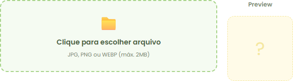 | 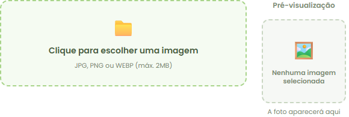 |
| 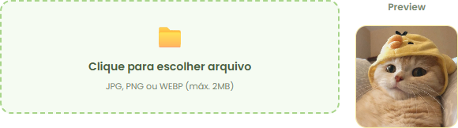 | 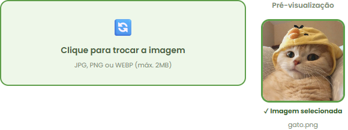 |

---

### P09 — Botão de favorito apresenta baixa visibilidade

**Heurística de Nielsen corrigida:** H8 — Estética e design minimalista · **Gravidade:** 2 — Menor

**O que mudou:**

- O pequeno círculo com coração branco (🤍), quase invisível sobre a foto, foi substituído por um botão com **contorno vermelho, ícone e texto**: "♡ Favoritar".
- Os estados ficaram claramente diferentes: **não favoritado** (fundo branco, contorno vermelho) e **favoritado** (fundo vermelho preenchido, "♥ Favoritado").
- O botão informa o estado a leitores de tela (`aria-pressed`).

**Como a mudança aplica a heurística de Nielsen:**

- **H8 — Estética e design minimalista (heurística corrigida):** o design minimalista não deve esconder ações importantes. O botão tem mais contraste e texto, e se destaca da foto sem poluir o card.
- **H1 — Visibilidade do status do sistema (complementar):** "Favoritar" e "Favoritado", com fundo vazio ou preenchido, mostram na hora se o animal já está nos favoritos.
- **H6 — Reconhecimento em vez de memorização (complementar):** a ação está escrita no botão, então o usuário não precisa adivinhar o que o ícone faz.

**Arquivos:** `client/src/pages/AnimaisListPage.jsx`, `client/src/styles/global.css`

| Antes | Depois |
|---|---|
|  | 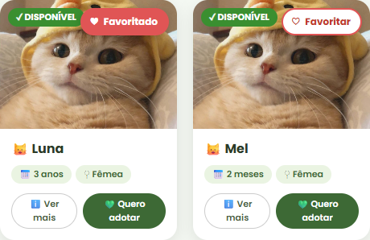 |

---

## 6. Resultado

Todas as dez melhorias do planejamento foram implementadas. As duas de maior gravidade (P04 e P10) reduzem o risco de exclusão acidental da conta e permitem que o usuário entenda e resolva um erro de sessão sem conhecimento técnico. As demais tornam a navegação mais flexível (P01, P06 e P07), padronizam a interface (P02, P03 e P08) e deixam mais claros e visíveis componentes específicos (P05 e P09).
