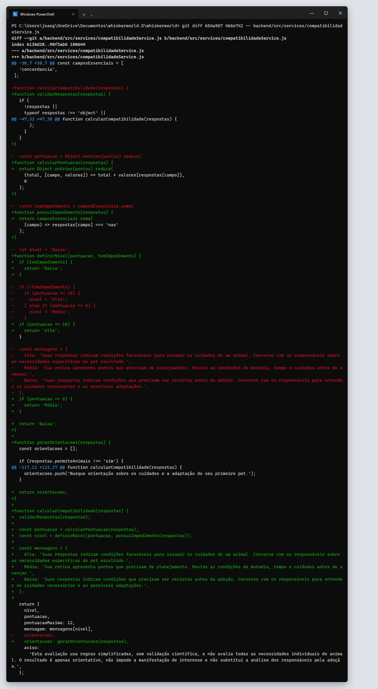
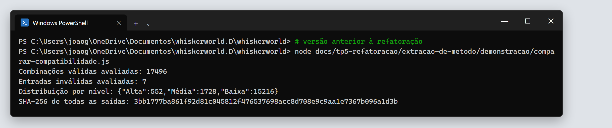
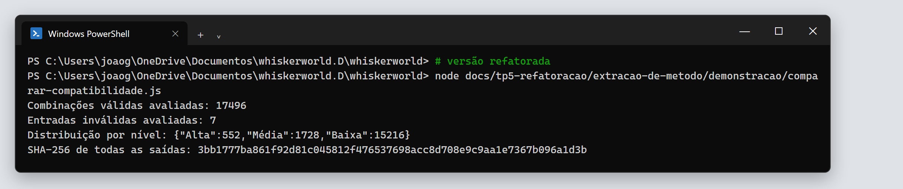
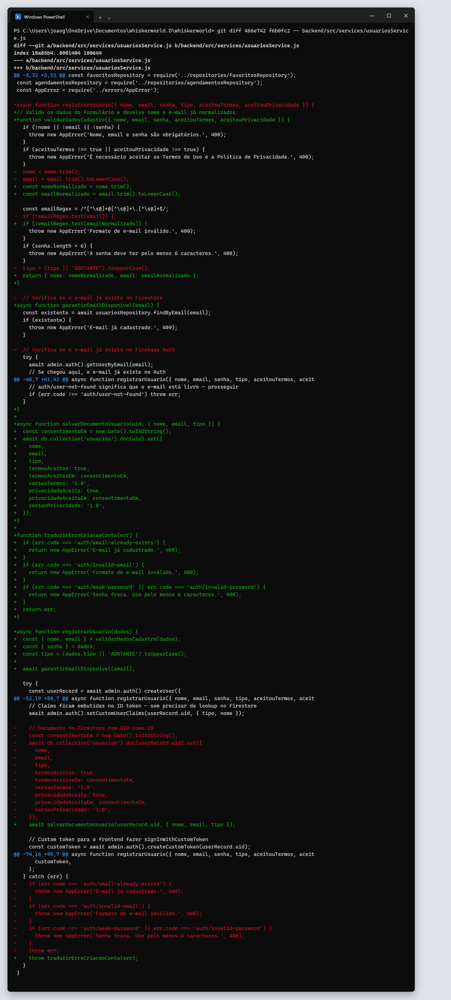
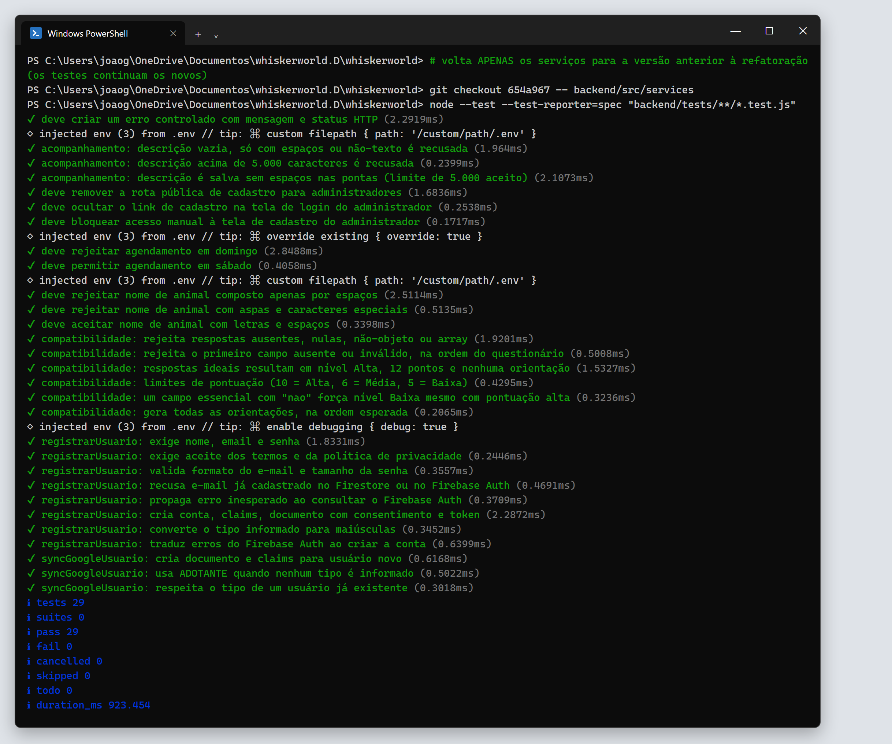
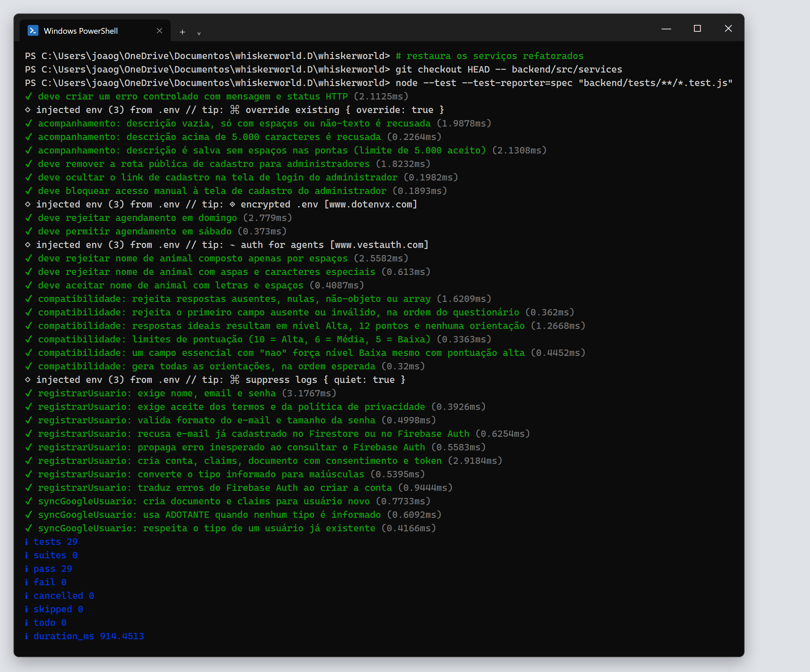

# 2. Refatorações planejadas

Segundo o capítulo 9 de *Engenharia de Software Moderna*, uma refatoração é **planejada** quando é tratada como uma tarefa própria, com tempo reservado, normalmente porque o problema é grande demais para ser resolvido no meio de outra tarefa.

As duas refatorações abaixo foram planejadas assim:

1. **Diagnóstico:** analisamos os serviços do backend e escolhemos os dois métodos mais longos com regra de negócio importante (smells S1 e S2 em [01-code-smells.md](01-code-smells.md)).
2. **Rede de segurança:** antes de alterar o código, criamos testes de caracterização para os dois serviços (commit `654a967`). Também criamos um script que gera um hash das saídas de `calcularCompatibilidade` para todas as combinações de respostas.
3. **Execução em passos pequenos:** uma refatoração por commit, rodando os testes depois de cada uma.
4. **Verificação:** os testes e o hash precisam ser iguais antes e depois.

---

## R1 — `calcularCompatibilidade`

| | |
|---|---|
| **Arquivo** | `backend/src/services/compatibilidadeService.js` |
| **Commit** | `466e742` |
| **Smell resolvido** | S1 – Método Longo |
| **Diff completo** | [evidencias/diff-01-compatibilidade.diff](evidencias/diff-01-compatibilidade.diff) |

### Justificativa

O questionário de compatibilidade é uma das funcionalidades adicionadas na TP4 e deve continuar mudando, com novas perguntas, pesos e orientações. Com tudo em um único método de 97 linhas, qualquer ajuste exigia ler validação, cálculo, classificação e orientações ao mesmo tempo. Separar as etapas permite alterar uma regra sem precisar entender as outras.

### Antes (97 linhas em um único método)

```js
function calcularCompatibilidade(respostas) {
  if (
    !respostas ||
    typeof respostas !== 'object' ||
    Array.isArray(respostas)
  ) {
    throw new AppError('Envie as respostas do questionário.', 400);
  }

  for (const [campo, opcoes] of Object.entries(opcoesPermitidas)) {
    if (!opcoes.includes(respostas[campo])) {
      throw new AppError(`Resposta obrigatória ausente ou inválida: ${campo}.`, 400);
    }
  }

  const pontuacao = Object.entries(pontos).reduce(
    (total, [campo, valores]) => total + valores[respostas[campo]],
    0
  );

  const temImpedimento = camposEssenciais.some(
    (campo) => respostas[campo] === 'nao'
  );

  let nivel = 'Baixa';

  if (!temImpedimento) {
    if (pontuacao >= 10) {
      nivel = 'Alta';
    } else if (pontuacao >= 6) {
      nivel = 'Média';
    }
  }

  const mensagens = { Alta: '...', Média: '...', Baixa: '...' };

  const orientacoes = [];

  if (respostas.permiteAnimais !== 'sim') {
    orientacoes.push('Confirme a autorização para manter animais no imóvel.');
  }
  // ... mais 9 blocos if semelhantes ...

  return { nivel, pontuacao, pontuacaoMaxima: 12, mensagem: mensagens[nivel], orientacoes, aviso: '...' };
}
```

### Depois (método principal com 22 linhas, que chama 5 métodos extraídos)

```js
function calcularCompatibilidade(respostas) {
  validarRespostas(respostas);

  const pontuacao = calcularPontuacao(respostas);
  const nivel = definirNivel(pontuacao, possuiImpedimento(respostas));

  const mensagens = { Alta: '...', Média: '...', Baixa: '...' };

  return {
    nivel,
    pontuacao,
    pontuacaoMaxima: 12,
    mensagem: mensagens[nivel],
    orientacoes: gerarOrientacoes(respostas),
    aviso: '...',
  };
}
```

Métodos extraídos:

```js
function validarRespostas(respostas) { /* as mesmas duas validações de antes */ }

function calcularPontuacao(respostas) {
  return Object.entries(pontos).reduce(
    (total, [campo, valores]) => total + valores[respostas[campo]],
    0
  );
}

function possuiImpedimento(respostas) {
  return camposEssenciais.some(
    (campo) => respostas[campo] === 'nao'
  );
}

function definirNivel(pontuacao, temImpedimento) {
  if (temImpedimento) {
    return 'Baixa';
  }

  if (pontuacao >= 10) {
    return 'Alta';
  }

  if (pontuacao >= 6) {
    return 'Média';
  }

  return 'Baixa';
}

function gerarOrientacoes(respostas) {
  const orientacoes = [];
  // ... os mesmos 10 blocos if, na mesma ordem ...
  return orientacoes;
}
```

### Diff da refatoração

Linhas em vermelho (`-`) foram removidas e linhas em verde (`+`) foram adicionadas.



### O que melhorou

- O método principal agora pode ser lido como um resumo do algoritmo: validar, pontuar, classificar e orientar.
- `definirNivel` deixou de usar uma variável mutável (`let nivel`) com `if` aninhado e passou a usar retornos antecipados. A regra "impedimento sempre resulta em Baixa" ficou na primeira linha.
- Para mudar um peso, um limite ou uma orientação, basta abrir o método correspondente.
- Cada etapa pode ser testada e reutilizada separadamente.

### Por que o comportamento não mudou

- **Testes:** 6 testes de caracterização cobrem entradas inválidas, a ordem das mensagens de erro, os limites de pontuação (10, 6 e 5), o impedimento e a lista completa de orientações. Todos passaram antes e depois.
- **Comparação exaustiva:** o script [comparar-compatibilidade.js](demonstracao/comparar-compatibilidade.js) executou a função para as **17.496 combinações possíveis** de respostas, além de 7 entradas inválidas. O hash SHA-256 das saídas foi o mesmo nas duas versões: `3bb1777ba861f92d81c045812f476537698acc8d708e9c9aa1e7367b096a1d3b`.





---

## R2 — `registrarUsuario`

| | |
|---|---|
| **Arquivo** | `backend/src/services/usuariosService.js` |
| **Commit** | `f6b0fc2` |
| **Smells resolvidos** | S2 – Método Longo · S3 – Comentários que explicam blocos |
| **Diff completo** | [evidencias/diff-02-registrar-usuario.diff](evidencias/diff-02-registrar-usuario.diff) |

### Justificativa

O cadastro é a porta de entrada do sistema e foi alterado na TP3 para registrar o consentimento exigido pela LGPD. Com 81 linhas, dois `try/catch` e comentários separando as etapas, era difícil saber onde mexer, por exemplo, para mudar a versão dos termos ou tratar um novo erro do Firebase.

### Antes (81 linhas)

```js
async function registrarUsuario({ nome, email, senha, tipo, aceitouTermos, aceitouPrivacidade }) {
  if (!nome || !email || !senha) {
    throw new AppError('Nome, email e senha são obrigatórios.', 400);
  }
  if (aceitouTermos !== true || aceitouPrivacidade !== true) {
    throw new AppError('É necessário aceitar os Termos de Uso e a Política de Privacidade.', 400);
  }
  nome = nome.trim();
  email = email.trim().toLowerCase();
  // ... valida formato do e-mail e tamanho da senha ...
  tipo = (tipo || 'ADOTANTE').toUpperCase();

  // Verifica se o e-mail já existe no Firestore
  const existente = await usuariosRepository.findByEmail(email);
  if (existente) {
    throw new AppError('E-mail já cadastrado.', 409);
  }

  // Verifica se o e-mail já existe no Firebase Auth
  try {
    await admin.auth().getUserByEmail(email);
    throw new AppError('E-mail já cadastrado.', 409);
  } catch (err) {
    if (err.status === 409) throw err;
    if (err.code !== 'auth/user-not-found') throw err;
  }

  try {
    const userRecord = await admin.auth().createUser({ email, password: senha, displayName: nome });
    await admin.auth().setCustomUserClaims(userRecord.uid, { tipo, nome });

    // Documento no Firestore com UID como ID
    const consentimentoEm = new Date().toISOString();
    await db.collection('usuarios').doc(userRecord.uid).set({
      nome, email, tipo,
      termosAceitos: true, termosAceitosEm: consentimentoEm, versaoTermos: '1.0',
      privacidadeAceita: true, privacidadeAceitaEm: consentimentoEm, versaoPrivacidade: '1.0',
    });

    const customToken = await admin.auth().createCustomToken(userRecord.uid);
    return { usuario: { id: userRecord.uid, nome, email, tipo }, customToken };
  } catch (err) {
    if (err.code === 'auth/email-already-exists') {
      throw new AppError('E-mail já cadastrado.', 409);
    }
    if (err.code === 'auth/invalid-email') {
      throw new AppError('Formato de e-mail inválido.', 400);
    }
    if (err.code === 'auth/weak-password' || err.code === 'auth/invalid-password') {
      throw new AppError('Senha fraca. Use pelo menos 6 caracteres.', 400);
    }
    throw err;
  }
}
```

### Depois (método principal com 30 linhas)

```js
async function registrarUsuario(dados) {
  const { nome, email } = validarDadosCadastro(dados);
  const { senha } = dados;
  const tipo = (dados.tipo || 'ADOTANTE').toUpperCase(); // vira normalizarTipoUsuario em R3

  await garantirEmailDisponivel(email);

  try {
    const userRecord = await admin.auth().createUser({ email, password: senha, displayName: nome });

    // Claims ficam embutidas no ID token — sem precisar de lookup no Firestore
    await admin.auth().setCustomUserClaims(userRecord.uid, { tipo, nome });

    await salvarDocumentoUsuario(userRecord.uid, { nome, email, tipo });

    // Custom token para o frontend fazer signInWithCustomToken
    const customToken = await admin.auth().createCustomToken(userRecord.uid);

    return { usuario: { id: userRecord.uid, nome, email, tipo }, customToken };
  } catch (err) {
    throw traduzirErroCriacaoConta(err);
  }
}
```

Métodos extraídos:

| Método | Responsabilidade |
|---|---|
| `validarDadosCadastro(dados)` | Campos obrigatórios, aceite dos termos, formato do e-mail e tamanho da senha. Devolve `nome` e `email` normalizados. |
| `garantirEmailDisponivel(email)` | Recusa e-mail já existente no Firestore ou no Firebase Auth. |
| `salvarDocumentoUsuario(uid, dados)` | Grava o documento do usuário com os campos de consentimento (LGPD). |
| `traduzirErroCriacaoConta(err)` | Converte códigos de erro do Firebase em `AppError` com mensagem em português. |

### Diff da refatoração



### O que melhorou

- O fluxo do cadastro pode ser lido em sequência: validar, garantir que o e-mail está livre, criar a conta, salvar o documento e devolver o token.
- Os comentários de "o que o bloco faz" deram lugar a nomes de métodos (smell S3).
- Cada `try/catch` ficou com uma única responsabilidade: um verifica disponibilidade e o outro traduz erros de criação.
- Os parâmetros deixaram de ser reatribuídos (`nome = nome.trim()`). Os valores normalizados agora vêm do retorno de `validarDadosCadastro`.

### Por que o comportamento não mudou

Foram criados 11 testes de caracterização para `usuariosService`, usando dublês do Firebase Auth, do Firestore e do repositório. Eles verificam:

- cada mensagem de erro e o código HTTP correspondente;
- a ordem das validações;
- a normalização de nome, e-mail e tipo;
- os dados enviados ao Firebase Auth e ao Firestore, incluindo os campos de consentimento;
- a tradução de cada código de erro do Firebase;
- a propagação de erros inesperados.

Todos passaram antes e depois da refatoração:

| Antes | Depois |
|---|---|
|  |  |
