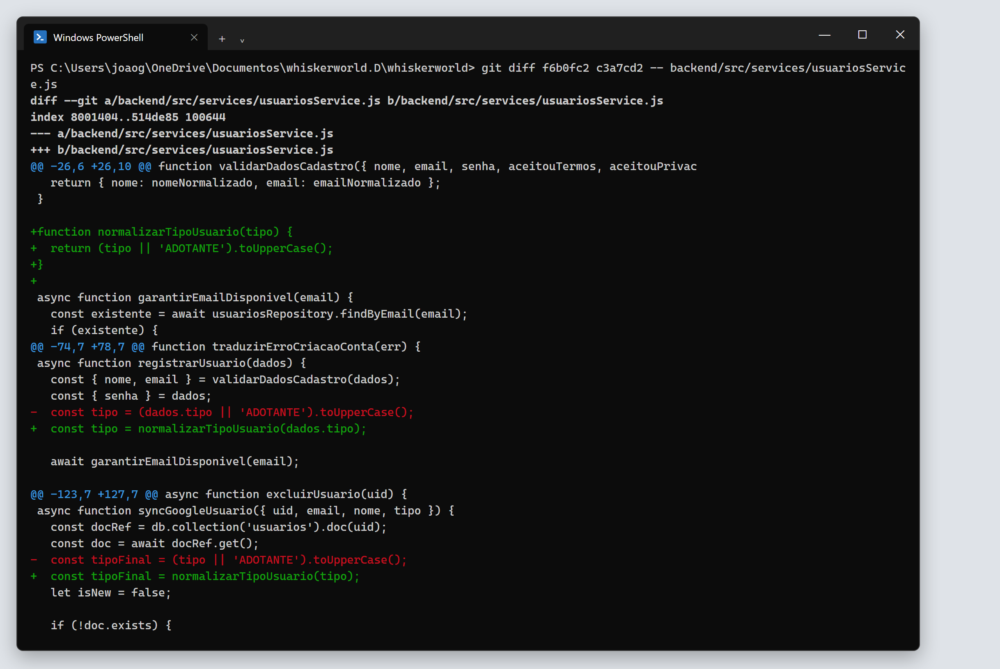

# 3. Refatoração oportunista

Segundo o capítulo 9 de *Engenharia de Software Moderna*, uma refatoração é **oportunista** quando é feita no meio de outra tarefa: ao trabalhar em um trecho de código, o desenvolvedor percebe um problema e o corrige na hora, sem planejamento prévio. É a regra do escoteiro: deixar o código um pouco melhor do que estava.

## R3 — `normalizarTipoUsuario`

| | |
|---|---|
| **Arquivo** | `backend/src/services/usuariosService.js` |
| **Commit** | `c3a7cd2` |
| **Smell mitigado** | S4 – Código Duplicado |
| **Diff completo** | [evidencias/diff-03-normalizar-tipo-usuario.diff](evidencias/diff-03-normalizar-tipo-usuario.diff) |

### Como surgiu

Ela não estava no plano. Durante a refatoração planejada R2, ao reorganizar o início de `registrarUsuario`, a linha que define o tipo do usuário ficou isolada:

```js
const tipo = (dados.tipo || 'ADOTANTE').toUpperCase();
```

Algumas linhas abaixo, no mesmo arquivo, `syncGoogleUsuario`, que trata o login pelo Google, tinha a mesma regra:

```js
const tipoFinal = (tipo || 'ADOTANTE').toUpperCase();
```

Como o arquivo já estava aberto e coberto pelos testes de caracterização, aproveitamos para extrair a regra. Fizemos isso em um commit separado de R2, para que o histórico mostre o que era planejado e o que foi oportunista.

### Antes

```js
async function registrarUsuario(dados) {
  ...
  const tipo = (dados.tipo || 'ADOTANTE').toUpperCase();
  ...
}

async function syncGoogleUsuario({ uid, email, nome, tipo }) {
  ...
  const tipoFinal = (tipo || 'ADOTANTE').toUpperCase();
  ...
}
```

### Depois

```js
function normalizarTipoUsuario(tipo) {
  return (tipo || 'ADOTANTE').toUpperCase();
}

async function registrarUsuario(dados) {
  ...
  const tipo = normalizarTipoUsuario(dados.tipo);
  ...
}

async function syncGoogleUsuario({ uid, email, nome, tipo }) {
  ...
  const tipoFinal = normalizarTipoUsuario(tipo);
  ...
}
```

### Diff da refatoração



### Justificativa

- A regra "o tipo padrão é ADOTANTE e é sempre gravado em maiúsculas" passou a ficar em um único lugar. Se mudar, por exemplo para validar apenas `ADOTANTE` e `ADMIN`, a alteração vale para o cadastro por e-mail e para o login pelo Google.
- O nome do método explica a intenção da expressão `(tipo || 'ADOTANTE').toUpperCase()`.

### Por que o comportamento não mudou

Os testes `registrarUsuario: converte o tipo informado para maiúsculas`, `syncGoogleUsuario: cria documento e claims para usuário novo` e `syncGoogleUsuario: usa ADOTANTE quando nenhum tipo é informado` cobrem a regra nos dois fluxos. Todos continuaram passando (29 de 29).

### Planejada x oportunista: comparação

| | R1 e R2 (planejadas) | R3 (oportunista) |
|---|---|---|
| Origem | Diagnóstico prévio dos serviços | Percebida durante R2 |
| Preparação | Testes de caracterização escritos antes | Aproveitou os testes que já existiam |
| Tamanho | Grande: método inteiro reorganizado | Pequena: uma expressão em dois lugares |
| Commit | Próprio, previsto no plano | Próprio, criado na hora |
