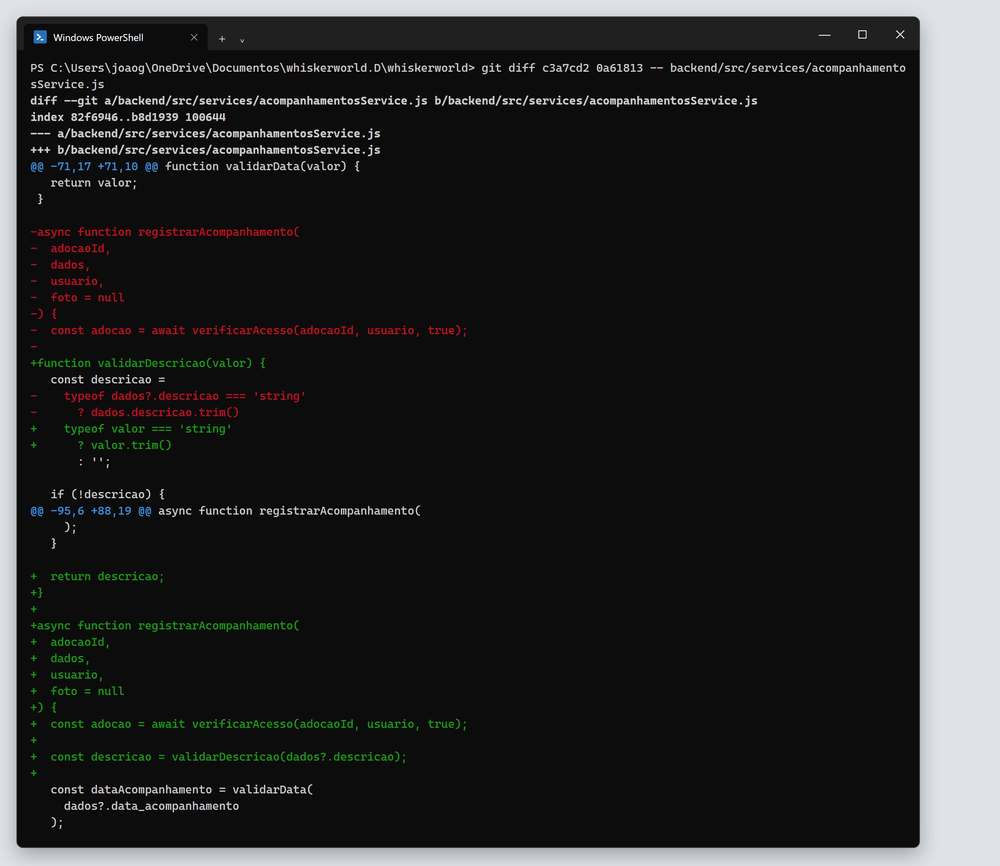
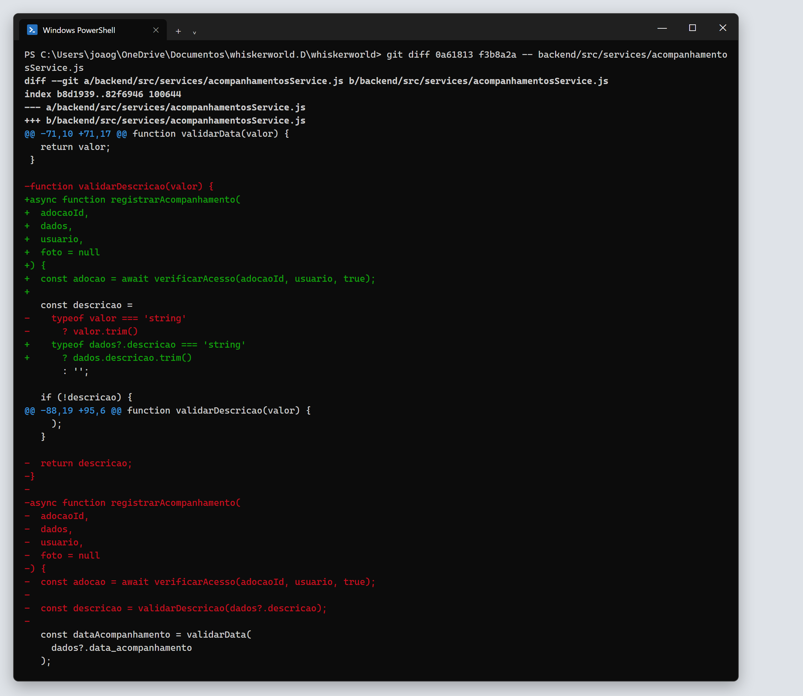
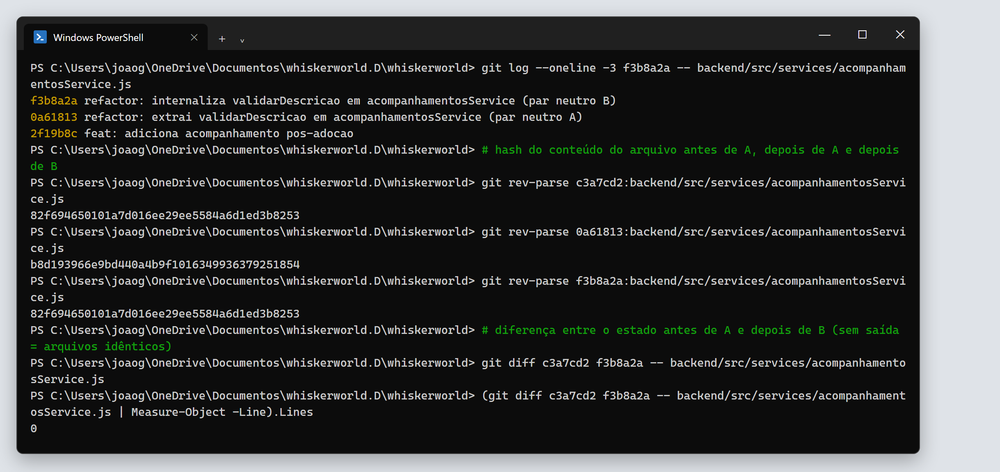

# 4. Par neutro: Extract Method (A) + Inline Method (B)

O trabalho pede um par de refatorações **A** e **B** em que **B desfaz A**. Aplicadas em sequência, elas não têm efeito no sistema.

No catálogo de Fowler, o inverso de **Extract Method** é **Inline Method**: o corpo de um método volta para o lugar de onde é chamado e o método deixa de existir. O capítulo 9 de *Engenharia de Software Moderna* apresenta as duas como operações inversas.

Isso mostra o caráter neutro da refatoração: uma refatoração apenas reorganiza o código, sem mudar o que ele faz. Se B desfaz A, o código volta exatamente ao estado inicial, e o comportamento também.

| | |
|---|---|
| **Arquivo** | `backend/src/services/acompanhamentosService.js` |
| **Método afetado** | `registrarAcompanhamento` |
| **Commit anterior a A** | `c3a7cd2` |
| **Commit A – Extract Method** | `0a61813` · [diff](evidencias/texto/diff-04-par-neutro-A-extract.diff) |
| **Commit B – Inline Method** | `f3b8a2a` · [diff](evidencias/texto/diff-05-par-neutro-B-inline.diff) |
| **Prova** | [evidencias/texto/prova-par-neutro.txt](evidencias/texto/prova-par-neutro.txt) |

---

## Estado inicial

A validação da descrição ficava dentro de `registrarAcompanhamento`:

```js
async function registrarAcompanhamento(adocaoId, dados, usuario, foto = null) {
  const adocao = await verificarAcesso(adocaoId, usuario, true);

  const descricao =
    typeof dados?.descricao === 'string'
      ? dados.descricao.trim()
      : '';

  if (!descricao) {
    throw new AppError('A descrição é obrigatória.', 400);
  }

  if (descricao.length > 5000) {
    throw new AppError('A descrição deve ter no máximo 5.000 caracteres.', 400);
  }

  const dataAcompanhamento = validarData(dados?.data_acompanhamento);
  ...
}
```

## Refatoração A — Extract Method (`0a61813`)

O bloco foi movido para `validarDescricao`, seguindo o padrão de `validarData`, que já existia no mesmo arquivo:

```js
function validarDescricao(valor) {
  const descricao =
    typeof valor === 'string'
      ? valor.trim()
      : '';

  if (!descricao) {
    throw new AppError('A descrição é obrigatória.', 400);
  }

  if (descricao.length > 5000) {
    throw new AppError('A descrição deve ter no máximo 5.000 caracteres.', 400);
  }

  return descricao;
}

async function registrarAcompanhamento(adocaoId, dados, usuario, foto = null) {
  const adocao = await verificarAcesso(adocaoId, usuario, true);

  const descricao = validarDescricao(dados?.descricao);

  const dataAcompanhamento = validarData(dados?.data_acompanhamento);
  ...
}
```



## Refatoração B — Inline Method (`f3b8a2a`)

O corpo de `validarDescricao` voltou para o lugar da chamada. O parâmetro `valor` foi trocado pelo argumento `dados?.descricao`, e o método foi removido. O código ficou igual ao **estado inicial**. O diff de B é o espelho do diff de A: o que A adicionou, B remove.



---

## Prova de que A + B não têm efeito

O Git identifica o conteúdo de cada arquivo por um hash. Arquivos com conteúdo igual têm o mesmo hash.

```text
Hash do conteúdo (git blob) de acompanhamentosService.js em cada commit:
  antes de A : 82f694650101a7d016ee29ee5584a6d1ed3b8253
  depois de A: b8d193966e9bd440a4b9f1016349936379251854   <- código diferente
  depois de B: 82f694650101a7d016ee29ee5584a6d1ed3b8253   <- igual ao inicial

$ git diff c3a7cd2 f3b8a2a -- backend/src/services/acompanhamentosService.js
(nenhuma diferença)
```

Além disso, os 3 testes de caracterização do acompanhamento passaram nos três estados (antes de A, depois de A e depois de B). Eles cobrem descrição ausente, só com espaços, não textual, acima de 5.000 caracteres, no limite e com espaços nas pontas.

Execução no PowerShell. A primeira e a última hash são iguais, e o diff entre o estado antes de A e depois de B tem 0 linhas:



Para reproduzir:

```powershell
git rev-parse c3a7cd2:backend/src/services/acompanhamentosService.js
git rev-parse 0a61813:backend/src/services/acompanhamentosService.js
git rev-parse f3b8a2a:backend/src/services/acompanhamentosService.js
git diff c3a7cd2 f3b8a2a -- backend/src/services/acompanhamentosService.js
```

## Observação

As duas refatorações são válidas isoladamente. A é uma Extração de Método legítima, e B também se justificaria, porque o trecho é curto e usado em um único lugar. O objetivo do par é **didático**: mostrar no próprio código que refatorações são transformações reversíveis, que preservam o comportamento. Por isso, o estado final do arquivo é igual ao inicial.
