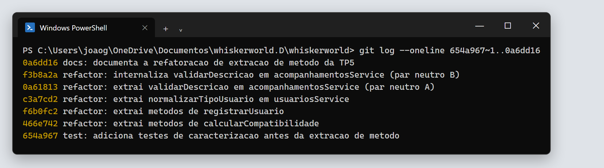

# Refatoração: Extração de Método (*Extract Method*)

Parte da **TP5 – Refatoração** do Whiskerworld. Este diretório reúne tudo o que foi feito com a refatoração **Extração de Método**, do catálogo de Martin Fowler, tomando como referência o [capítulo 9 de *Engenharia de Software Moderna*](https://engsoftmoderna.info/cap9.html).

> **Extração de Método:** pegar um trecho de código de um método, movê-lo para um novo método com um nome que explique o que ele faz e substituir o trecho original por uma chamada a esse novo método.

## Navegação

| # | Documento | O que contém |
|---|---|---|
| 1 | [01-code-smells.md](01-code-smells.md) | *Code smells* encontrados no projeto e por que cada um é um problema |
| 2 | [02-refatoracoes-planejadas.md](02-refatoracoes-planejadas.md) | Refatorações **planejadas**: justificativa e código antes/depois |
| 3 | [03-refatoracao-oportunista.md](03-refatoracao-oportunista.md) | Refatoração **oportunista**, feita durante outra refatoração |
| 4 | [04-par-neutro-extract-inline.md](04-par-neutro-extract-inline.md) | Par **A + B** (Extract Method + Inline Method) que se anulam |
| 5 | [05-demonstracao-em-sala.md](05-demonstracao-em-sala.md) | Roteiro da demonstração de que o comportamento não mudou |
| — | [demonstracao/](demonstracao/) | Script que compara as saídas antes e depois |
| — | [demonstracao/gerar-prints/](demonstracao/gerar-prints/) | Script que gera os prints a partir da saída real dos comandos |
| — | [evidencias/prints/](evidencias/prints/) | Prints do terminal (testes, hashes, diffs e par neutro) |
| — | [evidencias/](evidencias/) | As mesmas evidências em texto: diffs, resultados dos testes e hashes |

## Resumo

| # | Refatoração | Tipo | Arquivo | Commit |
|---|---|---|---|---|
| R1 | `calcularCompatibilidade` dividido em 5 métodos | Planejada | `backend/src/services/compatibilidadeService.js` | `466e742` |
| R2 | `registrarUsuario` dividido em 4 métodos | Planejada | `backend/src/services/usuariosService.js` | `f6b0fc2` |
| R3 | `normalizarTipoUsuario` extraído de código duplicado | Oportunista | `backend/src/services/usuariosService.js` | `c3a7cd2` |
| A | `validarDescricao` extraído (Extract Method) | Par neutro | `backend/src/services/acompanhamentosService.js` | `0a61813` |
| B | `validarDescricao` internalizado (Inline Method) | Par neutro | `backend/src/services/acompanhamentosService.js` | `f3b8a2a` |

**Tamanho dos métodos principais**

| Método | Antes | Depois |
|---|---|---|
| `calcularCompatibilidade` | 97 linhas | 22 linhas |
| `registrarUsuario` | 81 linhas | 30 linhas |

## Como garantimos que o comportamento não mudou

Antes de alterar qualquer código, criamos **testes de caracterização** (commit `654a967`). Esses testes registram como o sistema se comporta hoje: mensagens de erro, códigos HTTP, valores de retorno e dados gravados. A refatoração só foi aceita quando todos continuaram passando.

| Verificação | Antes da refatoração | Depois da refatoração |
|---|---|---|
| Testes automatizados (`npm test`) | 29 de 29 passando | 29 de 29 passando |
| Hash SHA-256 das saídas de `calcularCompatibilidade` nas 17.496 combinações de respostas | `3bb1777b…6a1d3b` | `3bb1777b…6a1d3b` |
| Conteúdo de `acompanhamentosService.js` antes de A e depois de B | blob `82f69465…` | blob `82f69465…` |

| Testes – antes | Testes – depois |
|---|---|
|  |  |

| Comparação exaustiva – antes | Comparação exaustiva – depois |
|---|---|
|  |  |

### Sobre as evidências

- **Prints** ([evidencias/prints/](evidencias/prints/)): as imagens foram **geradas automaticamente a partir da saída real dos comandos**, executados no Windows PowerShell deste repositório. O script [gerar-prints/gerar.sh](demonstracao/gerar-prints/gerar.sh) roda cada comando, captura a saída com as cores e a renderiza com a aparência do Windows Terminal. Para reproduzir as imagens, basta rodar o script de novo.
- **Arquivos de texto** ([evidencias/](evidencias/)): a mesma saída em texto puro (`testes-*.txt`, `hash-*.txt`, `prova-par-neutro.txt`). Os arquivos `.diff` mostram exatamente o que mudou em cada refatoração: linhas com `-` foram removidas e linhas com `+` foram adicionadas.

## Histórico de commits

Cada etapa ficou em um commit separado na branch `refatoracao/extracao-de-metodo`, para que antes e depois possam ser comparados com `git diff`:



```text
654a967 test: adiciona testes de caracterizacao antes da extracao de metodo
466e742 refactor: extrai metodos de calcularCompatibilidade              (R1 - planejada)
f6b0fc2 refactor: extrai metodos de registrarUsuario                     (R2 - planejada)
c3a7cd2 refactor: extrai normalizarTipoUsuario em usuariosService        (R3 - oportunista)
0a61813 refactor: extrai validarDescricao em acompanhamentosService      (A  - par neutro)
f3b8a2a refactor: internaliza validarDescricao em acompanhamentosService (B  - par neutro)
```

> Os hashes valem para esta branch. Se ela for integrada à `main` com *squash* ou *rebase*, os hashes mudam, mas os diffs salvos em [evidencias/](evidencias/) continuam valendo.
